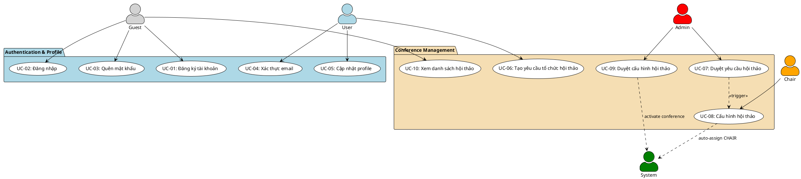

# NHÓM 1: AUTHENTICATION & CONFERENCE MANAGEMENT
## 10 Use Cases Cốt Lõi

---

## 📊 Sơ đồ Use Case - Nhóm 1



---

## 📋 ĐẶC TẢ CHI TIẾT CÁC USE CASE

### UC-01: Đăng ký tài khoản

**Mô tả**: Guest đăng ký tài khoản mới trên hệ thống

**Actor**: Guest

**Tiền điều kiện**: 
- Chưa có tài khoản trong hệ thống
- Email chưa được đăng ký trước đó

**Hậu điều kiện**:
- Tài khoản mới được tạo với trạng thái chưa xác thực
- Email xác thực được gửi đến địa chỉ email đã đăng ký

**Luồng chính**:
1. Guest truy cập trang đăng ký (GET /register)
2. Hệ thống hiển thị form đăng ký
3. Guest nhập thông tin:
   - Họ tên đầy đủ (full_name)
   - Email
   - Mật khẩu (tối thiểu 8 ký tự)
   - Xác nhận mật khẩu
   - Tổ chức/Đơn vị (organization)
   - Số điện thoại (phone) - tùy chọn
4. Guest nhấn "Đăng ký"
5. Hệ thống validate dữ liệu
6. Hệ thống hash mật khẩu (bcrypt)
7. Hệ thống tạo record trong bảng `nguoidung`:
   ```sql
   INSERT INTO nguoidung (
     full_name, email, password, organization, 
     phone, locked, email_verified_at, created_at
   ) VALUES (?, ?, ?, ?, ?, 0, NULL, NOW())
   ```
8. Hệ thống tạo verification token
9. Hệ thống gửi email xác thực với link: `/email/verify/{id}/{hash}`
10. Hệ thống hiển thị thông báo: "Đăng ký thành công! Vui lòng kiểm tra email để xác thực tài khoản"
11. Hệ thống tự động đăng nhập user (tùy chọn)
12. Hệ thống chuyển hướng đến dashboard

**Luồng thay thế**:

*5a. Email đã tồn tại*:
1. Hệ thống hiển thị lỗi: "Email này đã được sử dụng"
2. Quay lại bước 3

*5b. Mật khẩu không khớp*:
1. Hệ thống hiển thị lỗi: "Mật khẩu xác nhận không khớp"
2. Quay lại bước 3

*5c. Dữ liệu không hợp lệ*:
1. Hệ thống hiển thị các lỗi validation
2. Quay lại bước 3

**Route**: `POST /register`

**Controller**: `Auth\AuthController@register`

**Database**:
- Table: `nguoidung`
- Fields: user_id (PK), full_name, email (unique), password, organization, phone, locked, email_verified_at, created_at, updated_at

---

### UC-02: Đăng nhập

**Mô tả**: User đăng nhập vào hệ thống bằng email và mật khẩu

**Actor**: Guest, User

**Tiền điều kiện**: 
- Đã có tài khoản trong hệ thống
- Tài khoản chưa bị khóa (locked = 0)

**Hậu điều kiện**:
- User được xác thực
- Session được tạo
- User được chuyển đến dashboard phù hợp với vai trò

**Luồng chính**:
1. Guest truy cập trang đăng nhập (GET /login)
2. Hệ thống hiển thị form đăng nhập
3. Guest nhập:
   - Email
   - Mật khẩu
   - (Tùy chọn) Ghi nhớ đăng nhập
4. Guest nhấn "Đăng nhập"
5. Hệ thống kiểm tra credentials:
   ```sql
   SELECT * FROM nguoidung 
   WHERE email = ? 
   AND locked = 0
   ```
6. Hệ thống verify password (bcrypt)
7. Hệ thống tạo session
8. Hệ thống ghi log đăng nhập:
   ```sql
   INSERT INTO activity_logs (
     user_id, action, log_type, ip_address, user_agent
   ) VALUES (?, 'LOGIN', 'AUTH', ?, ?)
   ```
9. Hệ thống query vai trò của user:
   ```sql
   SELECT DISTINCT role_code 
   FROM vaitronguoidung 
   WHERE user_id = ?
   ```
10. Hệ thống chuyển hướng dựa trên vai trò:
    - ADMIN → /admin/dashboard
    - CHAIR → /chair/dashboard
    - REVIEWER → /reviewer/dashboard
    - AUTHOR → /author/dashboard
    - Default → /dashboard

**Luồng thay thế**:

*6a. Email không tồn tại*:
1. Hệ thống hiển thị lỗi: "Email hoặc mật khẩu không đúng"
2. Hệ thống ghi log failed login
3. Quay lại bước 3

*6b. Mật khẩu sai*:
1. Hệ thống hiển thị lỗi: "Email hoặc mật khẩu không đúng"
2. Hệ thống tăng failed_attempts counter
3. Hệ thống ghi log failed login
4. Quay lại bước 3

*6c. Tài khoản bị khóa*:
1. Hệ thống hiển thị lỗi: "Tài khoản của bạn đã bị khóa. Vui lòng liên hệ quản trị viên"
2. Hệ thống ghi log blocked login attempt
3. Use case kết thúc

*6d. Email chưa được xác thực*:
1. Hệ thống cho phép đăng nhập nhưng hiển thị cảnh báo
2. Hệ thống hiển thị nút "Gửi lại email xác thực"
3. Tiếp tục bước 8

**Route**: `POST /login`

**Controller**: `Auth\AuthController@login`

**Database**:
- Tables: `nguoidung`, `vaitronguoidung`, `activity_logs`

---

### UC-03: Quên mật khẩu

**Mô tả**: User yêu cầu reset mật khẩu qua email

**Actor**: Guest

**Tiền điều kiện**: 
- Email đã được đăng ký trong hệ thống

**Hậu điều kiện**:
- Reset token được tạo và lưu vào database
- Email reset password được gửi đến user
- Token có hiệu lực 60 phút

**Luồng chính**:
1. Guest truy cập trang quên mật khẩu (GET /forgot-password)
2. Hệ thống hiển thị form nhập email
3. Guest nhập email
4. Guest nhấn "Gửi link reset"
5. Hệ thống kiểm tra email tồn tại:
   ```sql
   SELECT * FROM nguoidung WHERE email = ?
   ```
6. Hệ thống tạo reset token (random 64 ký tự)
7. Hệ thống lưu token vào bảng `password_resets`:
   ```sql
   INSERT INTO password_resets (email, token, created_at)
   VALUES (?, ?, NOW())
   ON DUPLICATE KEY UPDATE token = ?, created_at = NOW()
   ```
8. Hệ thống gửi email với link: `/reset-password/{token}`
9. Hệ thống hiển thị: "Link reset mật khẩu đã được gửi đến email của bạn"
10. Guest nhận email và click link
11. Hệ thống kiểm tra token hợp lệ (chưa hết hạn 60 phút)
12. Hệ thống hiển thị form nhập mật khẩu mới
13. Guest nhập mật khẩu mới và xác nhận
14. Guest nhấn "Đặt lại mật khẩu"
15. Hệ thống validate mật khẩu mới
16. Hệ thống hash mật khẩu mới
17. Hệ thống cập nhật password:
    ```sql
    UPDATE nguoidung 
    SET password = ?, updated_at = NOW() 
    WHERE email = ?
    ```
18. Hệ thống xóa token đã sử dụng:
    ```sql
    DELETE FROM password_resets WHERE email = ?
    ```
19. Hệ thống hiển thị: "Mật khẩu đã được đặt lại thành công"
20. Hệ thống chuyển hướng đến trang đăng nhập

**Luồng thay thế**:

*5a. Email không tồn tại*:
1. Hệ thống vẫn hiển thị: "Nếu email tồn tại, link reset đã được gửi" (security best practice)
2. Use case kết thúc

*11a. Token đã hết hạn*:
1. Hệ thống hiển thị lỗi: "Link reset đã hết hạn. Vui lòng yêu cầu lại"
2. Hệ thống xóa token hết hạn
3. Use case kết thúc

*11b. Token không hợp lệ*:
1. Hệ thống hiển thị lỗi 404: "Link không hợp lệ"
2. Use case kết thúc

*15a. Mật khẩu mới không đủ mạnh*:
1. Hệ thống hiển thị lỗi: "Mật khẩu phải có ít nhất 8 ký tự"
2. Quay lại bước 13

**Route**: 
- `POST /forgot-password` (send link)
- `POST /reset-password` (reset password)

**Controller**: `Auth\AuthController@sendResetLink`, `Auth\AuthController@resetPassword`

**Database**:
- Tables: `nguoidung`, `password_resets`

---

### UC-04: Xác thực email

**Mô tả**: User xác thực địa chỉ email thông qua link trong email

**Actor**: User

**Tiền điều kiện**: 
- User đã đăng ký tài khoản
- Email chưa được xác thực (email_verified_at = NULL)

**Hậu điều kiện**:
- Email được đánh dấu là đã xác thực
- User có thể truy cập đầy đủ các chức năng

**Luồng chính**:
1. User nhận email chứa link xác thực
2. User click vào link: `/email/verify/{id}/{hash}`
3. Hệ thống kiểm tra:
   - ID hợp lệ
   - Hash khớp với email (SHA256)
   - User chưa xác thực email
4. Hệ thống cập nhật:
   ```sql
   UPDATE nguoidung 
   SET email_verified_at = NOW() 
   WHERE user_id = ? 
   AND email_verified_at IS NULL
   ```
5. Hệ thống ghi log:
   ```sql
   INSERT INTO activity_logs (
     user_id, action, log_type
   ) VALUES (?, 'EMAIL_VERIFIED', 'AUTH')
   ```
6. Hệ thống hiển thị thông báo: "Email đã được xác thực thành công!"
7. Hệ thống chuyển hướng đến dashboard

**Luồng thay thế**:

*3a. Link không hợp lệ*:
1. Hệ thống hiển thị lỗi 403: "Link xác thực không hợp lệ"
2. Use case kết thúc

*3b. Email đã được xác thực*:
1. Hệ thống hiển thị: "Email đã được xác thực trước đó"
2. Hệ thống chuyển hướng đến dashboard
3. Use case kết thúc

**Luồng bổ sung - Gửi lại email xác thực**:
1. User truy cập /email/verify (notification page)
2. User nhấn "Gửi lại email xác thực"
3. Hệ thống kiểm tra throttle (6 requests/minute)
4. Hệ thống tạo link mới và gửi email
5. Hệ thống hiển thị: "Email xác thực đã được gửi lại"

**Route**: 
- `GET /email/verify/{id}/{hash}` (verify)
- `POST /email/verification-notification` (resend)

**Controller**: `Auth\AuthController@verifyEmail`, `Auth\AuthController@resendVerificationEmail`

**Database**:
- Tables: `nguoidung`, `activity_logs`

---

### UC-05: Cập nhật profile

**Mô tả**: User cập nhật thông tin cá nhân

**Actor**: User (authenticated)

**Tiền điều kiện**: 
- User đã đăng nhập

**Hậu điều kiện**:
- Thông tin profile được cập nhật
- Avatar được lưu (nếu upload)

**Luồng chính**:
1. User truy cập trang profile (GET /profile)
2. Hệ thống load thông tin hiện tại:
   ```sql
   SELECT * FROM nguoidung WHERE user_id = ?
   ```
3. Hệ thống hiển thị form với dữ liệu đã điền sẵn
4. User chỉnh sửa:
   - Họ tên (full_name)
   - Tổ chức (organization)
   - Số điện thoại (phone)
   - Địa chỉ (address)
   - Bio/Giới thiệu (bio)
   - Avatar (file upload)
5. User nhấn "Cập nhật"
6. Hệ thống validate dữ liệu
7. Nếu có upload avatar:
   - Validate file (jpg, png, max 2MB)
   - Resize ảnh về 300x300px
   - Lưu vào `public/avatars/{user_id}_{timestamp}.jpg`
   - Xóa avatar cũ
8. Hệ thống cập nhật database:
   ```sql
   UPDATE nguoidung 
   SET full_name = ?, organization = ?, 
       phone = ?, address = ?, bio = ?,
       avatar = ?, updated_at = NOW()
   WHERE user_id = ?
   ```
9. Hệ thống ghi log:
   ```sql
   INSERT INTO activity_logs (
     user_id, action, log_type
   ) VALUES (?, 'PROFILE_UPDATED', 'USER')
   ```
10. Hệ thống hiển thị: "Cập nhật profile thành công!"
11. Hệ thống reload trang profile

**Luồng thay thế**:

*6a. Dữ liệu không hợp lệ*:
1. Hệ thống hiển thị lỗi validation
2. Quay lại bước 4

*7a. Avatar không hợp lệ*:
1. Hệ thống hiển thị lỗi: "File phải là ảnh (jpg, png) và nhỏ hơn 2MB"
2. Bỏ qua upload avatar
3. Tiếp tục bước 8

**Luồng bổ sung - Đổi mật khẩu**:
1. User truy cập tab "Đổi mật khẩu"
2. User nhập:
   - Mật khẩu hiện tại
   - Mật khẩu mới
   - Xác nhận mật khẩu mới
3. Hệ thống verify mật khẩu hiện tại
4. Hệ thống validate mật khẩu mới
5. Hệ thống hash và cập nhật:
   ```sql
   UPDATE nguoidung 
   SET password = ?, updated_at = NOW() 
   WHERE user_id = ?
   ```
6. Hệ thống hiển thị: "Đổi mật khẩu thành công!"

**Route**: 
- `PUT /profile` (update profile)
- `POST /profile/avatar` (upload avatar)
- `PUT /profile/password` (change password)

**Controller**: `Auth\AuthController@updateProfile`, `Auth\AuthController@updateAvatar`, `Auth\AuthController@updatePassword`

**Database**:
- Tables: `nguoidung`, `activity_logs`
- Storage: `public/avatars/`

---

### UC-06: Tạo yêu cầu tổ chức hội thảo

**Mô tả**: User gửi đề xuất tổ chức hội thảo khoa học mới

**Actor**: User (authenticated & verified)

**Tiền điều kiện**: 
- User đã đăng nhập và xác thực email
- User chưa có yêu cầu PENDING cho cùng hội thảo

**Hậu điều kiện**:
- Yêu cầu được tạo với status = 'PENDING'
- File proposal được lưu trữ
- Admin nhận thông báo

**Luồng chính**:
1. User truy cập trang tạo yêu cầu (GET /create-conference)
2. Hệ thống hiển thị form với các trường:
   - Tên hội thảo (title) *
   - Mục tiêu (objective) *
   - Lĩnh vực (field)
   - Cấp hội thảo (level_code): KHOA/TRUONG *
   - Tên khoa (faculty_name)
   - Ngày dự kiến (expected_date)
   - Đơn vị tổ chức (affiliation)
   - Thông tin Chair:
     - Họ tên (chair_fullname) *
     - Email (chair_email) *
     - Số điện thoại (chair_phone)
   - Danh sách đồng Chairs (co_chairs[]) - dynamic
   - File đề xuất (proposal_file) * - PDF, max 10MB
3. User điền đầy đủ thông tin
4. User upload file proposal (PDF)
5. User nhấn "Gửi yêu cầu"
6. Hệ thống validate:
   - Required fields
   - Email format
   - File type (PDF) và size (max 10MB)
7. Hệ thống lưu file:
   - Path: `storage/conference-requests/{timestamp}_{filename}.pdf`
   - Generate unique filename
8. Hệ thống tạo record trong `yeucauhoithao`:
   ```sql
   INSERT INTO yeucauhoithao (
     user_id, title, objective, field, level_code,
     faculty_name, expected_date, affiliation,
     chair_fullname, chair_email, chair_phone,
     proposal_file, status, created_at
   ) VALUES (?, ?, ?, ?, ?, ?, ?, ?, ?, ?, ?, ?, 'PENDING', NOW())
   ```
9. Hệ thống lưu co-chairs vào `themvienbosup`:
   ```sql
   INSERT INTO themvienbosup (
     request_id, fullname, email, affiliation
   ) VALUES (?, ?, ?, ?)
   ```
10. Hệ thống tạo thông báo cho tất cả ADMIN:
    ```sql
    INSERT INTO user_notifications (
      user_id, title, message, type, 
      data, is_read, created_at
    )
    SELECT user_id, 
           'Yêu cầu tổ chức hội thảo mới', 
           'User {name} đã gửi yêu cầu tổ chức hội thảo: {title}',
           'CONFERENCE_REQUEST',
           JSON_OBJECT('request_id', ?),
           0, NOW()
    FROM vaitronguoidung 
    WHERE role_code = 'ADMIN'
    ```
11. Hệ thống ghi activity log
12. Hệ thống hiển thị: "Yêu cầu đã được gửi thành công! Vui lòng chờ admin phê duyệt"
13. Hệ thống chuyển hướng đến trang "Yêu cầu của tôi"

**Luồng thay thế**:

*6a. Validation failed*:
1. Hệ thống hiển thị các lỗi cụ thể
2. Quay lại bước 3

*7a. File upload failed*:
1. Hệ thống hiển thị lỗi: "Không thể tải file lên. Vui lòng thử lại"
2. Quay lại bước 4

*8a. Database error*:
1. Hệ thống rollback transaction
2. Hệ thống xóa file đã upload
3. Hệ thống hiển thị lỗi: "Có lỗi xảy ra. Vui lòng thử lại sau"
4. Use case kết thúc

**Route**: 
- `GET /create-conference` (form)
- `POST /conference-requests` (submit)

**Controller**: `ConferenceRequestController@store`

**Database**:
- Tables: `yeucauhoithao`, `themvienbosup`, `user_notifications`, `activity_logs`
- Storage: `storage/conference-requests/`

**Business Rules**:
- Mỗi user chỉ có thể có 1 yêu cầu PENDING tại một thời điểm
- File proposal bắt buộc phải là PDF
- Email chair phải hợp lệ (có thể khác email người tạo)
- Co-chairs là optional, có thể thêm nhiều người

---

### UC-07: Duyệt yêu cầu hội thảo

**Mô tả**: Admin xem xét và phê duyệt/từ chối yêu cầu tổ chức hội thảo

**Actor**: Admin

**Tiền điều kiện**: 
- Admin đã đăng nhập
- Có yêu cầu với status = 'PENDING'

**Hậu điều kiện**:
- Yêu cầu được cập nhật status: 'APPROVED' hoặc 'REJECTED'
- Nếu APPROVED: conference được tạo với status 'PENDING_CONFIGURATION'
- User được thông báo qua notification và email

**Luồng chính**:
1. Admin truy cập danh sách yêu cầu (GET /admin/conference-requests)
2. Hệ thống query và hiển thị:
   ```sql
   SELECT r.*, u.full_name as requester_name, u.email
   FROM yeucauhoithao r
   JOIN nguoidung u ON r.user_id = u.user_id
   WHERE r.status = 'PENDING'
   ORDER BY r.created_at DESC
   ```
3. Admin click vào yêu cầu cần xem
4. Hệ thống hiển thị chi tiết đầy đủ:
   - Thông tin hội thảo
   - Thông tin người đề xuất
   - Thông tin Chair và co-chairs
   - Link download proposal file
   - Lịch sử changes (nếu có)
5. Admin download và xem file proposal
6. Admin quyết định:

**Nhánh A - APPROVE (Phê duyệt)**:
1. Admin nhấn "Phê duyệt"
2. Hệ thống hiển thị modal xác nhận
3. Admin có thể nhập ghi chú (optional)
4. Admin xác nhận
5. Hệ thống bắt đầu transaction:
   
   a. Cập nhật status yêu cầu:
   ```sql
   UPDATE yeucauhoithao 
   SET status = 'APPROVED',
       approved_by = ?,
       approved_at = NOW(),
       admin_notes = ?
   WHERE request_id = ?
   ```
   
   b. Tạo conference mới:
   ```sql
   INSERT INTO hoithao (
     code, title, objective, level_code,
     organizer_id, status, created_at
   ) VALUES (
     CONCAT('CONF', YEAR(NOW()), LPAD(NEXTVAL, 4, '0')),
     ?, ?, ?, ?, 'PENDING_CONFIGURATION', NOW()
   )
   ```
   
   c. Tạo liên kết với request:
   ```sql
   UPDATE yeucauhoithao 
   SET conference_id = ? 
   WHERE request_id = ?
   ```
   
   d. Tự động gán role CHAIR cho organizer (UC-10 trigger):
   ```sql
   INSERT INTO vaitronguoidung (
     user_id, role_code, conference_id, assigned_at
   ) VALUES (?, 'CHAIR', ?, NOW())
   ```
   
   e. Tạo thông báo cho user:
   ```sql
   INSERT INTO user_notifications (
     user_id, title, message, type, 
     data, is_read, created_at
   ) VALUES (
     ?,
     'Yêu cầu hội thảo được phê duyệt',
     'Yêu cầu tổ chức hội thảo "{title}" đã được phê duyệt. Vui lòng hoàn tất cấu hình.',
     'CONFERENCE_APPROVED',
     JSON_OBJECT('conference_id', ?, 'request_id', ?),
     0, NOW()
   )
   ```
   
   f. Gửi email thông báo approval
   
   g. Ghi activity log

6. Hệ thống commit transaction
7. Hệ thống hiển thị: "Yêu cầu đã được phê duyệt! Conference đã được tạo"
8. Hệ thống quay lại danh sách yêu cầu

**Nhánh B - REJECT (Từ chối)**:
1. Admin nhấn "Từ chối"
2. Hệ thống hiển thị modal yêu cầu nhập lý do
3. Admin nhập lý do từ chối (required)
4. Admin xác nhận
5. Hệ thống cập nhật:
   ```sql
   UPDATE yeucauhoithao 
   SET status = 'REJECTED',
       rejected_by = ?,
       rejected_at = NOW(),
       rejection_reason = ?
   WHERE request_id = ?
   ```
6. Hệ thống tạo thông báo cho user:
   ```sql
   INSERT INTO user_notifications (
     user_id, title, message, type, data
   ) VALUES (
     ?,
     'Yêu cầu hội thảo bị từ chối',
     'Yêu cầu tổ chức hội thảo "{title}" đã bị từ chối. Lý do: {reason}',
     'CONFERENCE_REJECTED',
     JSON_OBJECT('request_id', ?, 'reason', ?)
   )
   ```
7. Hệ thống gửi email thông báo rejection với lý do
8. Hệ thống hiển thị: "Yêu cầu đã bị từ chối"
9. Hệ thống quay lại danh sách

**Luồng thay thế**:

*5a. File proposal bị lỗi*:
1. Admin báo lỗi
2. Admin có thể yêu cầu user upload lại
3. Quay lại bước 2

**Route**: 
- `GET /admin/conference-requests` (list)
- `GET /admin/conference-requests/{id}` (detail)
- `POST /admin/conference-requests/{id}/approve` (approve)
- `POST /admin/conference-requests/{id}/reject` (reject)

**Controller**: `Admin\ConferenceRequestController@index`, `@show`, `@approve`, `@reject`

**Database**:
- Tables: `yeucauhoithao`, `hoithao`, `vaitronguoidung`, `user_notifications`, `activity_logs`

**Business Rules**:
- Chỉ yêu cầu PENDING mới được duyệt
- Rejection reason là bắt buộc khi từ chối
- Approval tự động tạo conference và gán CHAIR role
- Conference mới có status 'PENDING_CONFIGURATION' (chờ Chair cấu hình)

---

### UC-08: Cấu hình hội thảo

**Mô tả**: Chair cấu hình thông tin chi tiết cho hội thảo đã được phê duyệt

**Actor**: Chair

**Tiền điều kiện**: 
- User có role CHAIR cho conference
- Conference có status = 'PENDING_CONFIGURATION'

**Hậu điều kiện**:
- Thông tin hội thảo được cập nhật đầy đủ
- Tracks được tạo
- Deadlines được thiết lập
- Conference chuyển sang status = 'PENDING_ADMIN_APPROVAL' (chờ admin duyệt cấu hình)

**Luồng chính**:
1. Chair đăng nhập và nhận thông báo yêu cầu cấu hình
2. Chair truy cập form cấu hình (GET /chair/conferences/configure/{requestId})
3. Hệ thống load thông tin từ request:
   ```sql
   SELECT r.*, h.conference_id 
   FROM yeucauhoithao r
   JOIN hoithao h ON r.conference_id = h.conference_id
   WHERE r.request_id = ? 
   AND r.status = 'APPROVED'
   ```
4. Hệ thống hiển thị form multi-step với data đã có
5. Chair điền thông tin:

**Step 1: Thông tin cơ bản**
- Tên đầy đủ (title) - đã có
- Tên viết tắt (acronym)
- Mô tả chi tiết (description)
- Ngày bắt đầu (start_date) *
- Ngày kết thúc (end_date) *
- Địa điểm (venue)
- Website (url)
- Logo hội thảo (file upload)

**Step 2: Deadlines**
- Hạn nộp bài (paper_submission_deadline) *
- Hạn thông báo kết quả (notification_deadline) *
- Hạn nộp bản chính thức (camera_ready_deadline) *
- Hạn đăng ký tham dự (registration_deadline)

**Step 3: Tracks/Chuyên đề** (có thể thêm nhiều)
- Tên track (title) *
- Mã track (code)
- Mô tả (description)
- Chair của track
- Keywords

**Step 4: Cấu hình khác**
- Cho phép bidding (bidding_enabled): Yes/No
- Hạn bidding (bidding_deadline) - nếu enabled
- Số reviewer tối thiểu/bài (min_reviewers_per_paper): default 3
- Số reviewer tối đa/bài (max_reviewers_per_paper): default 5
- Template file bài báo (template_file): upload
- Hướng dẫn authors (author_guidelines): rich text

6. Chair nhấn "Lưu và gửi duyệt"
7. Hệ thống validate tất cả dữ liệu:
   - Required fields
   - Date logic (start < end, paper_deadline < notification < camera_ready)
   - File uploads (logo, template)

8. Hệ thống bắt đầu transaction:

a. Cập nhật conference:
```sql
UPDATE hoithao SET
  title = ?, acronym = ?, description = ?,
  start_date = ?, end_date = ?,
  venue = ?, url = ?, logo = ?,
  paper_submission_deadline = ?,
  notification_deadline = ?,
  camera_ready_deadline = ?,
  registration_deadline = ?,
  bidding_enabled = ?,
  bidding_deadline = ?,
  min_reviewers_per_paper = ?,
  max_reviewers_per_paper = ?,
  template_file = ?,
  author_guidelines = ?,
  status = 'PENDING_ADMIN_APPROVAL',
  updated_at = NOW()
WHERE conference_id = ?
```

b. Tạo tracks:
```sql
INSERT INTO tieuban (
  conference_id, code, title, description, 
  chair_id, keywords, created_at
) VALUES (?, ?, ?, ?, ?, ?, NOW())
```

c. Upload và lưu files (logo, template)

d. Cập nhật request status:
```sql
UPDATE yeucauhoithao 
SET configuration_completed_at = NOW()
WHERE request_id = ?
```

e. Tạo thông báo cho Admin:
```sql
INSERT INTO user_notifications (
  user_id, title, message, type, data
)
SELECT user_id,
  'Cấu hình hội thảo hoàn tất',
  'Chair đã hoàn tất cấu hình hội thảo "{title}". Vui lòng kiểm tra và phê duyệt.',
  'CONFERENCE_CONFIGURED',
  JSON_OBJECT('conference_id', ?)
FROM vaitronguoidung 
WHERE role_code = 'ADMIN'
```

f. Ghi activity log

9. Hệ thống commit transaction
10. Hệ thống hiển thị: "Cấu hình đã được lưu! Vui lòng chờ admin phê duyệt"
11. Hệ thống chuyển đến trang xem trước conference

**Luồng thay thế**:

*7a. Validation failed*:
1. Hệ thống highlight các fields lỗi
2. Quay lại step tương ứng

*7b. Date logic error*:
1. Hệ thống hiển thị: "Các deadline phải theo thứ tự logic"
2. Quay lại Step 2

*8a. File upload failed*:
1. Hệ thống rollback và hiển thị lỗi
2. Cho phép Chair thử lại

**Luồng bổ sung - Lưu nháp**:
1. Chair có thể "Lưu nháp" tại bất kỳ step nào
2. Conference giữ status = 'PENDING_CONFIGURATION'
3. Chair có thể quay lại chỉnh sửa sau

**Route**: 
- `GET /chair/conferences/configure/{requestId}` (form)
- `POST /chair/conferences/configure/{requestId}` (submit)

**Controller**: `Chair\ConferenceSetupController@configure`, `@store`

**Database**:
- Tables: `hoithao`, `tieuban`, `yeucauhoithao`, `user_notifications`, `activity_logs`
- Storage: `public/conferences/logos/`, `public/conferences/templates/`

**Business Rules**:
- Chỉ CHAIR của conference mới được cấu hình
- Ít nhất phải có 1 track
- paper_submission_deadline phải trước start_date
- Nếu bidding_enabled = true, bidding_deadline phải trước paper_submission_deadline

---

### UC-09: Duyệt cấu hình hội thảo

**Mô tả**: Admin kiểm tra và phê duyệt cấu hình hội thảo từ Chair

**Actor**: Admin

**Tiền điều kiện**: 
- Conference có status = 'PENDING_ADMIN_APPROVAL'
- Cấu hình đã được Chair hoàn tất

**Hậu điều kiện**:
- Conference được kích hoạt với status = 'ACTIVE'
- Hội thảo hiển thị public
- Chair có thể bắt đầu mời reviewers và nhận bài

**Luồng chính**:
1. Admin truy cập danh sách conference cần duyệt (GET /admin/configured-conferences)
2. Hệ thống query:
   ```sql
   SELECT h.*, r.request_id, 
          u.full_name as organizer_name
   FROM hoithao h
   JOIN yeucauhoithao r ON h.conference_id = r.conference_id
   JOIN nguoidung u ON h.organizer_id = u.user_id
   WHERE h.status = 'PENDING_ADMIN_APPROVAL'
   ORDER BY r.configuration_completed_at DESC
   ```
3. Admin click vào conference cần xem
4. Hệ thống hiển thị chi tiết cấu hình:
   - Thông tin cơ bản
   - Deadlines timeline visualization
   - Danh sách tracks
   - Cấu hình bidding và review
   - Files (logo, template)
5. Admin review kỹ lưỡng:
   - Check date logic
   - Review tracks phù hợp không
   - Xem template file
   - Check author guidelines

**Nhánh A - APPROVE (Phê duyệt)**:
1. Admin nhấn "Phê duyệt và Kích hoạt"
2. Hệ thống hiển thị modal xác nhận
3. Admin xác nhận
4. Hệ thống bắt đầu transaction:

a. Activate conference:
```sql
UPDATE hoithao 
SET status = 'ACTIVE',
    activated_by = ?,
    activated_at = NOW()
WHERE conference_id = ?
```

b. Tạo thông báo cho Chair:
```sql
INSERT INTO user_notifications (
  user_id, title, message, type, data
) VALUES (
  ?,
  'Hội thảo đã được kích hoạt',
  'Hội thảo "{title}" đã được phê duyệt và kích hoạt. Bạn có thể bắt đầu mời reviewers và nhận bài.',
  'CONFERENCE_ACTIVATED',
  JSON_OBJECT('conference_id', ?)
)
```

c. Tạo conference page public (cache warm-up)

d. Initialize conference statistics:
```sql
INSERT INTO conference_statistics (
  conference_id, total_papers, total_reviewers,
  total_reviews, created_at
) VALUES (?, 0, 0, 0, NOW())
```

e. Gửi email thông báo cho Chair

f. Ghi activity log với level = 'CRITICAL'

5. Hệ thống commit transaction
6. Hệ thống hiển thị: "Hội thảo đã được kích hoạt thành công!"
7. Hệ thống quay lại danh sách

**Nhánh B - REQUEST CHANGES (Yêu cầu sửa)**:
1. Admin nhấn "Yêu cầu chỉnh sửa"
2. Hệ thống hiển thị form nhập feedback
3. Admin nhập chi tiết những điểm cần sửa
4. Admin xác nhận
5. Hệ thống cập nhật:
```sql
UPDATE hoithao 
SET status = 'PENDING_CONFIGURATION',
    admin_feedback = ?
WHERE conference_id = ?
```
6. Hệ thống tạo thông báo cho Chair với feedback
7. Chair nhận được yêu cầu và sửa lại (quay về UC-08)

**Luồng thay thế**:

*5a. Date conflicts found*:
1. Admin có thể sửa trực tiếp hoặc yêu cầu Chair sửa
2. Admin nhấn "Chỉnh sửa nhanh"
3. Admin sửa dates
4. Tiếp tục approve flow

**Route**: 
- `GET /admin/configured-conferences` (list)
- `GET /admin/configured-conferences/{id}` (detail)
- `POST /admin/conference-requests/{id}/approve-conference` (approve)
- `POST /admin/conference-requests/{id}/reject-conference` (request changes)

**Controller**: `Admin\ConferenceRequestController@configuredConferences`, `@showConference`, `@approveConference`, `@rejectConference`

**Database**:
- Tables: `hoithao`, `user_notifications`, `conference_statistics`, `activity_logs`

**Business Rules**:
- Chỉ conference PENDING_ADMIN_APPROVAL mới được duyệt
- Sau khi ACTIVE, conference hiển thị public
- ACTIVE conference có thể nhận papers và mời reviewers
- Admin có thể tạm dừng conference bằng cách đổi status về 'PAUSED'

---

### UC-10: Xem danh sách hội thảo

**Mô tả**: Guest/User xem danh sách các hội thảo đang diễn ra và sắp diễn ra

**Actor**: Guest, User

**Tiền điều kiện**: Không có

**Hậu điều kiện**: Hiển thị danh sách hội thảo với filters và search

**Luồng chính**:
1. Guest/User truy cập trang chủ hội thảo (GET /conferences)
2. Hệ thống query conferences:
   ```sql
   SELECT h.conference_id, h.code, h.title, h.acronym,
          h.start_date, h.end_date, h.venue,
          h.paper_submission_deadline, h.logo,
          h.status, h.created_at,
          COUNT(DISTINCT b.paper_id) as total_papers,
          COUNT(DISTINCT vr.user_id) as total_reviewers
   FROM hoithao h
   LEFT JOIN baibao b ON h.conference_id = b.conference_id
   LEFT JOIN vaitronguoidung vr ON h.conference_id = vr.conference_id 
        AND vr.role_code = 'REVIEWER'
   WHERE h.status IN ('ACTIVE', 'ONGOING', 'COMPLETED')
   GROUP BY h.conference_id
   ORDER BY h.start_date DESC
   ```
3. Hệ thống hiển thị:
   - Grid/List view của conferences
   - Mỗi card có:
     - Logo
     - Title & Acronym
     - Dates (start - end)
     - Venue
     - Status badge
     - Paper submission deadline (nếu chưa hết hạn)
     - Số papers đã nộp
     - "View Details" button

4. User có thể filter:
   - Status: Active/Upcoming/Past
   - Date range
   - Level: KHOA/TRUONG
   - Search by title/acronym

5. User có thể sort:
   - Newest first
   - Start date
   - End date
   - Most papers

6. User click "View Details" trên conference
7. Use case chuyển sang UC-02 (Xem chi tiết)

**Luồng thay thế**:

*2a. Không có conference nào*:
1. Hệ thống hiển thị: "Chưa có hội thảo nào được tổ chức"
2. Nếu User đã login: Hiển thị nút "Đề xuất tổ chức hội thảo"

*4a. Search với keyword*:
1. User nhập keyword vào search box
2. Hệ thống filter real-time:
   ```sql
   WHERE (h.title LIKE ? OR h.acronym LIKE ? OR h.code LIKE ?)
   ```

**Route**: `GET /conferences`

**Controller**: `ConferenceController@index`

**Database**: 
- Tables: `hoithao`, `baibao`, `vaitronguoidung`

**Business Rules**:
- Chỉ hiển thị conference có status = 'ACTIVE', 'ONGOING', 'COMPLETED'
- PENDING và DRAFT conferences không hiển thị public
- Sort mặc định: conferences sắp diễn ra trước

---

## 📊 TỔNG KẾT NHÓM 1

### Thống kê:
- **Tổng số UC**: 10
- **Actors**: Guest (4 UC), User (4 UC), Chair (1 UC), Admin (2 UC), System (auto-triggers)
- **Database tables**: nguoidung, vaitronguoidung, yeucauhoithao, hoithao, tieuban, user_notifications, activity_logs, password_resets, themvienbosup, conference_statistics

### Workflow chính:
```
Guest → UC-01 (Đăng ký) → UC-04 (Xác thực email) → User
User → UC-06 (Tạo yêu cầu) → Admin UC-07 (Duyệt) → Conference created
System → Auto-assign CHAIR role
Chair → UC-08 (Cấu hình) → Admin UC-09 (Duyệt cấu hình) → ACTIVE
Guest/User → UC-10 (Xem danh sách hội thảo)
```

### Mối quan hệ giữa các UC:
- UC-01 → UC-04 (include): Đăng ký trigger gửi email verify
- UC-02 → UC-05 (extend): Sau khi login có thể update profile
- UC-06 → UC-07 (dependency): Yêu cầu phải được duyệt
- UC-07 → UC-08 (trigger): Approval tạo conference và trigger UC-08
- UC-08 → UC-09 (dependency): Cấu hình phải được admin duyệt
- UC-09 → System (trigger): Activate conference trigger các jobs

### Key Business Rules:
1. Email verification bắt buộc để tạo conference request
2. Conference lifecycle: PENDING_CONFIGURATION → PENDING_ADMIN_APPROVAL → ACTIVE
3. Auto-assign CHAIR role khi conference được approve
4. Deadlines phải theo logic: paper < notification < camera_ready < conference dates
5. Ít nhất 1 track phải được tạo

---

**File này là phần 1 trong series đặc tả Use Case. Tiếp tục với các nhóm khác...**
