# NHÓM 3: REVIEWER INVITATION & BIDDING
## 10 Use Cases - Quản lý Phản biện viên

---

## 📊 Sơ đồ Use Case - Nhóm 3

```plantuml
@startuml UC_Group3_Reviewer_Management
!theme plain
skinparam actorStyle awesome

actor "User" as User #LightBlue
actor "Reviewer" as Reviewer #Cyan
actor "Chair" as Chair #Orange
actor "Admin" as Admin #Red
actor "System" as System #Green

package "Reviewer Recruitment" #LightGreen {
  usecase (UC-21: Yêu cầu tham gia làm reviewer) as UC21
  usecase (UC-22: Duyệt yêu cầu làm reviewer) as UC22
  usecase (UC-23: Mời reviewer qua email) as UC23
  usecase (UC-24: Chấp nhận lời mời reviewer) as UC24
}

package "Paper Bidding" #LightCoral {
  usecase (UC-25: Xem danh sách bài để bidding) as UC25
  usecase (UC-26: Bidding cho bài báo) as UC26
  usecase (UC-27: Xem kết quả bidding) as UC27
}

package "Reviewer Assignment" #Wheat {
  usecase (UC-28: Phân công reviewer tự động) as UC28
  usecase (UC-29: Phân công reviewer thủ công) as UC29
  usecase (UC-30: Xem danh sách phân công) as UC30
}

User --> UC21
Admin --> UC22
Chair --> UC23
Reviewer --> UC24
Reviewer --> UC25
Reviewer --> UC26
Reviewer --> UC27
Chair --> UC28
Chair --> UC29
Chair --> UC30
Reviewer --> UC30

UC21 ..> UC22 : <<require approval>>
UC23 ..> UC24 : <<email invitation>>
UC24 ..> System : auto-assign REVIEWER role
UC26 ..> UC28 : <<input for auto-assign>>
UC28 ..> UC29 : <<fallback>>

@enduml
```



---

## 📋 ĐẶC TẢ CHI TIẾT CÁC USE CASE

### UC-21: Yêu cầu tham gia làm reviewer

**Mô tả**: User gửi yêu cầu tham gia với tư cách reviewer cho hội thảo

**Tác nhân**: User (đã đăng nhập)

**Điều kiện tiên quyết**: 
- User đã đăng nhập và xác thực email
- Conference đang ở trạng thái ACTIVE
- User chưa có role REVIEWER cho conference này
- User chưa có yêu cầu PENDING cho conference này

**Điều kiện hậu tố**:
- Yêu cầu được tạo với trạng thái PENDING
- Admin và Chair nhận được thông báo về yêu cầu mới
- User có thể theo dõi trạng thái yêu cầu

**Luồng sự kiện chính**:
1. User truy cập trang chi tiết hội thảo
2. User thấy nút "Request to be Reviewer" (nếu đủ điều kiện)
3. User click vào nút này
4. Hệ thống hiển thị form yêu cầu với các trường:
   - Lĩnh vực chuyên môn (expertise areas) - bắt buộc
   - Danh sách chủ đề quan tâm (research interests) - bắt buộc
   - Kinh nghiệm phản biện (reviewing experience) - mô tả chi tiết
   - Số bài có thể phản biện (number of papers) - từ 1-10
   - Lý do muốn tham gia (motivation) - tùy chọn
   - CV file (PDF, max 5MB) - tùy chọn
5. User điền thông tin và nhấn "Submit Request"
6. Hệ thống kiểm tra tính hợp lệ của dữ liệu
7. Hệ thống tạo bản ghi yêu cầu mới trong database
8. Hệ thống gửi thông báo đến Admin và Chair của conference
9. Hệ thống hiển thị thông báo thành công
10. User được chuyển đến trang theo dõi yêu cầu

**Luồng thay thế**:

*2a. User đã là REVIEWER của conference*:
- Hệ thống không hiển thị nút "Request to be Reviewer"
- Hiển thị "You are already a reviewer for this conference"

*2b. User đã có yêu cầu PENDING*:
- Hiển thị "You have a pending request"
- Hiển thị trạng thái yêu cầu hiện tại

*6a. Dữ liệu không hợp lệ*:
- Hệ thống hiển thị các lỗi cụ thể
- User sửa lại thông tin và submit lại

*7a. File CV quá lớn hoặc sai định dạng*:
- Hiển thị lỗi "File must be PDF and less than 5MB"
- User upload lại file hợp lệ

---

### UC-22: Duyệt yêu cầu làm reviewer

**Mô tả**: Admin xem xét và phê duyệt/từ chối yêu cầu làm reviewer cho tất cả conferences

**Tác nhân**: Admin

**Điều kiện tiên quyết**: 
- Admin đã đăng nhập với role ADMIN
- Có ít nhất một yêu cầu ở trạng thái PENDING

**Điều kiện hậu tố**:
- Yêu cầu được cập nhật trạng thái (APPROVED hoặc REJECTED)
- Nếu APPROVED: User được gán role REVIEWER tự động cho conference đó
- User nhận thông báo và email về quyết định
- Chair của conference nhận notification về reviewer mới (nếu approved)
- System log ghi lại action của Admin

**Luồng sự kiện chính**:
1. Admin truy cập trang "Admin > Join Requests" (route: /admin/join-requests)
2. Hệ thống hiển thị danh sách các yêu cầu PENDING từ TẤT CẢ conferences với thông tin:
   - Tên người yêu cầu
   - Email
   - Conference name
   - Lĩnh vực chuyên môn
   - Số bài có thể review
   - Ngày gửi yêu cầu
3. Admin có thể filter theo conference hoặc status
4. Admin click vào một yêu cầu để xem chi tiết
5. Hệ thống hiển thị đầy đủ thông tin:
   - Profile của user
   - Conference details
   - Expertise areas
   - Research interests
   - Reviewing experience
   - CV file (nếu có)
   - Motivation letter
6. Admin đánh giá thông tin

**Nhánh A - Phê duyệt**:
1. Admin click nút "Approve"
2. Hệ thống hiển thị modal xác nhận
3. Admin có thể thêm ghi chú (optional)
4. Admin xác nhận phê duyệt
5. Hệ thống cập nhật trạng thái yêu cầu thành APPROVED
6. Hệ thống tự động gán role REVIEWER cho user
7. Hệ thống gửi thông báo và email chúc mừng đến user
8. User có thể bắt đầu tham gia bidding (nếu enabled)

**Nhánh B - Từ chối**:
1. Admin click nút "Reject"
2. Hệ thống yêu cầu nhập lý do từ chối (required)
3. Admin nhập lý do và xác nhận
4. Hệ thống cập nhật trạng thái thành REJECTED
5. Hệ thống gửi thông báo và email với lý do từ chối đến user
6. Hệ thống notify Chair của conference về rejection
7. User có thể gửi yêu cầu mới sau 30 ngày

**Luồng thay thế**:

*2a. Không có yêu cầu PENDING nào*:
- Hiển thị "No pending reviewer requests"
- Hiển thị lịch sử các yêu cầu đã xử lý
- Admin có thể filter theo conference hoặc date range

*6a. CV file bị lỗi hoặc không mở được*:
- Admin có thể yêu cầu user upload lại
- Hoặc bỏ qua CV và duyệt dựa trên thông tin khác

**Nhánh B.3a - Không nhập lý do từ chối**:
- Hệ thống yêu cầu bắt buộc nhập lý do
- Admin phải nhập lý do trước khi tiếp tục

---

### UC-23: Mời reviewer qua email

**Mô tả**: Chair gửi email mời chuyên gia bên ngoài làm reviewer

**Tác nhân**: Chair

**Điều kiện tiên quyết**: 
- Chair đã đăng nhập
- Conference đang ở trạng thái ACTIVE
- Email người được mời chưa có trong danh sách reviewers

**Điều kiện hậu tố**:
- Invitation được tạo với token duy nhất
- Email mời được gửi kèm link đăng ký
- Token có hiệu lực 7 ngày
- Hệ thống theo dõi trạng thái invitation

**Luồng sự kiện chính**:
1. Chair truy cập trang mời reviewer
2. Chair có thể chọn 2 cách:
   - Mời từng người (single invitation)
   - Mời hàng loạt (bulk invitation - upload CSV)
3. **Với single invitation**:
   - Chair nhập email người được mời
   - Chair nhập tên (optional - để personalize email)
   - Chair chọn suggested areas (từ tracks)
   - Chair thêm personal message (optional)
4. Chair click "Send Invitation"
5. Hệ thống kiểm tra email chưa được mời trước đó
6. Hệ thống tạo invitation token (unique, expires in 7 days)
7. Hệ thống tạo bản ghi invitation trong database
8. Hệ thống gửi email với nội dung:
   - Lời mời từ Chair
   - Thông tin về conference
   - Link đăng ký với token: `/reviewer/invitation/{token}`
   - Hạn chót phản hồi (7 ngày)
   - Thông tin liên hệ
9. Hệ thống hiển thị thông báo "Invitation sent successfully"
10. Chair có thể tiếp tục mời người khác

**Luồng thay thế**:

*5a. Email đã được mời trước đó*:
- Nếu invitation còn PENDING: Hiển thị option "Resend Invitation"
- Nếu đã ACCEPTED: Hiển thị "This person is already a reviewer"
- Nếu đã DECLINED: Cho phép gửi lại invitation mới

*6a. Token generation failed*:
- Hệ thống retry tạo token mới
- Nếu vẫn lỗi, hiển thị thông báo lỗi hệ thống

**Luồng bổ sung - Bulk Invitation**:
1. Chair chọn "Bulk Invitation"
2. Chair download template CSV
3. Chair điền thông tin: Email, Name, Expertise
4. Chair upload file CSV
5. Hệ thống validate từng dòng
6. Hệ thống hiển thị preview với các emails hợp lệ/lỗi
7. Chair xác nhận gửi
8. Hệ thống gửi email đến tất cả địa chỉ hợp lệ
9. Hiển thị kết quả: X invitations sent, Y failed

---

### UC-24: Chấp nhận lời mời reviewer

**Mô tả**: Người được mời truy cập link và chấp nhận làm reviewer

**Tác nhân**: Guest (người nhận email mời)

**Điều kiện tiên quyết**: 
- Đã nhận email invitation với token hợp lệ
- Token chưa hết hạn (trong vòng 7 ngày)
- Invitation còn ở trạng thái PENDING

**Điều kiện hậu tố**:
- Nếu chưa có account: Account mới được tạo
- User được gán role REVIEWER
- Invitation status = ACCEPTED
- User có thể bắt đầu bidding/reviewing
- Chair nhận thông báo về acceptance

**Luồng sự kiện chính**:
1. Guest click vào link trong email: `/reviewer/invitation/{token}`
2. Hệ thống verify token hợp lệ và chưa hết hạn
3. Hệ thống hiển thị trang invitation với thông tin:
   - Conference details
   - Role & responsibilities
   - Timeline
   - Expected workload
4. Hệ thống check email đã có account chưa

**Nhánh A - Đã có account**:
1. Hiển thị "Login to accept invitation"
2. Guest login bằng account hiện có
3. Sau khi login, hiển thị confirmation page
4. User click "Accept Invitation"
5. Hệ thống gán role REVIEWER cho user
6. Hệ thống cập nhật invitation status = ACCEPTED
7. Hiển thị welcome message và hướng dẫn tiếp theo
8. User được redirect đến reviewer dashboard

**Nhánh B - Chưa có account**:
1. Hiển thị form đăng ký nhanh với email đã điền sẵn
2. User nhập thêm:
   - Full name
   - Password
   - Organization
   - Phone (optional)
3. User click "Create Account & Accept"
4. Hệ thống tạo account mới
5. Hệ thống gán role REVIEWER
6. Hệ thống cập nhật invitation status = ACCEPTED
7. Hệ thống gửi email welcome
8. User được tự động login và redirect đến reviewer dashboard

**Sau khi accept (cả 2 nhánh)**:
- Hệ thống gửi thông báo đến Chair
- Hệ thống cập nhật số lượng reviewers của conference
- User thấy conference trong "My Conferences" section

**Luồng thay thế**:

*2a. Token không hợp lệ*:
- Hiển thị "Invalid invitation link"
- Cung cấp link liên hệ Chair

*2b. Token đã hết hạn*:
- Hiển thị "This invitation has expired"
- Cung cấp form "Request new invitation"
- User nhập email để yêu cầu gửi lại

*2c. Invitation đã được accept trước đó*:
- Hiển thị "You have already accepted this invitation"
- Redirect đến login nếu chưa login
- Redirect đến reviewer dashboard nếu đã login

**Luồng bổ sung - Decline Invitation**:
1. User click "Decline Invitation"
2. Hệ thống yêu cầu nhập lý do (optional)
3. User xác nhận decline
4. Hệ thống cập nhật invitation status = DECLINED
5. Hệ thống gửi thông báo đến Chair
6. Hiển thị "Thank you for your response"

---

### UC-25: Xem danh sách bài để bidding

**Mô tả**: Reviewer xem danh sách các bài báo để thực hiện bidding

**Tác nhân**: Reviewer

**Điều kiện tiên quyết**: 
- User có role REVIEWER cho conference
- Conference đã enable bidding
- Đang trong thời gian bidding (chưa quá bidding_deadline)
- Có ít nhất 1 paper đã được submit

**Điều kiện hậu tố**:
- Hiển thị danh sách papers với thông tin cần thiết
- Reviewer có thể thấy bidding status của mình
- Papers được filter theo expertise matching

**Luồng sự kiện chính**:
1. Reviewer login và truy cập trang bidding
2. Hệ thống hiển thị banner countdown đến bidding deadline
3. Hệ thống query và hiển thị danh sách papers với thông tin:
   - Paper ID
   - Title (không hiển thị authors - double blind)
   - Abstract
   - Keywords
   - Track/Topic
   - Type (Full/Short/Poster)
   - Match score (% phù hợp với expertise của reviewer)
   - Current bidding status (Not bidded / Interest / Neutral / Conflict)
4. Hệ thống highlight các papers:
   - **Green**: High match (>80%)
   - **Yellow**: Medium match (50-80%)
   - **Gray**: Low match (<50%)
   - **Red**: Already bidded with Conflict
5. Reviewer có thể filter papers theo:
   - Track
   - Keywords
   - Match score
   - Bidding status
6. Reviewer có thể search theo title hoặc keywords
7. Hệ thống hiển thị statistics:
   - Total papers: X
   - Papers bidded: Y
   - Papers with interest: Z
   - Conflicts declared: W
8. Reviewer click vào paper để xem chi tiết và bidding

**Luồng thay thế**:

*1a. Bidding chưa mở*:
- Hiển thị "Bidding will open on [date]"
- Hiển thị countdown timer
- Allow preview papers nhưng chưa cho bid

*1b. Bidding đã đóng*:
- Hiển thị "Bidding period has ended"
- Hiển thị lịch sử bidding của reviewer
- Không cho phép thay đổi bids

*3a. Chưa có paper nào*:
- Hiển thị "No papers available for bidding yet"
- Hiển thị paper submission deadline

**Luồng bổ sung - Smart Matching**:
1. Hệ thống analyze expertise của reviewer (từ profile)
2. Hệ thống analyze keywords của papers
3. Hệ thống tính match score dựa trên:
   - Keyword overlap
   - Research area similarity
   - Previous bidding patterns
4. Hệ thống sort papers theo match score (high to low)
5. Hệ thống suggest top 10 papers phù hợp nhất

---

### UC-26: Bidding cho bài báo

**Mô tả**: Reviewer biểu thị mức độ quan tâm hoặc xung đột với từng bài báo

**Tác nhân**: Reviewer

**Điều kiện tiên quyết**: 
- Reviewer đã xem danh sách papers (UC-25)
- Đang trong thời gian bidding
- Paper chưa bị withdrawn

**Điều kiện hậu tố**:
- Bidding preference được lưu
- Có thể thay đổi bid trước deadline
- Chair/System sử dụng bids để phân công reviewer

**Luồng sự kiện chính**:
1. Reviewer đang ở trang danh sách papers
2. Reviewer click vào một paper để xem chi tiết
3. Hệ thống hiển thị:
   - Abstract đầy đủ
   - Keywords
   - Track information
   - Reviewer's expertise match score
4. Hệ thống hiển thị bidding options với 4 mức:
   - **High Interest (3)**: "I really want to review this paper"
   - **Willing (2)**: "I can review this paper"
   - **Not Interested (1)**: "I prefer not to review this"
   - **Conflict (0)**: "I have a conflict of interest"
5. Reviewer chọn một option
6. Nếu chọn **Conflict**, hệ thống yêu cầu:
   - Lý do conflict (dropdown):
     - Co-author
     - Same institution
     - Collaboration in last 2 years
     - Personal relationship
     - Other (require explanation)
   - Explanation (text field) - required nếu chọn "Other"
7. Reviewer có thể thêm private notes (chỉ Chair thấy)
8. Reviewer click "Submit Bid"
9. Hệ thống lưu bidding preference
10. Hệ thống hiển thị confirmation
11. Hệ thống cập nhật bidding status của paper
12. Reviewer được quay về danh sách papers

**Luồng thay thế**:

*5a. Reviewer đã bid trước đó*:
- Hiển thị current bid
- Cho phép thay đổi bid
- Hiển thị "Last updated: [timestamp]"

*6a. Không chọn lý do conflict*:
- Hệ thống không cho submit
- Hiển thị "Please specify the reason for conflict"

*9a. Database error*:
- Hiển thị error message
- Cho phép retry
- Lưu data tạm thời (local storage)

**Luồng bổ sung - Quick Bidding**:
1. Từ danh sách papers, reviewer có thể quick bid
2. Mỗi paper có dropdown ngay trên row
3. Chọn level (High/Willing/Not/Conflict)
4. Bid được lưu ngay lập tức (AJAX)
5. Visual feedback (màu sắc thay đổi)
6. Không cần navigate đến detail page

**Bidding Statistics Real-time**:
- Sau mỗi bid, cập nhật số liệu:
  - "You have bidded on X/Y papers"
  - "Papers with high interest: Z"
  - "Conflicts declared: W"
- Progress bar hiển thị % completion

---

### UC-27: Xem kết quả bidding

**Mô tả**: Reviewer và Chair xem tổng hợp kết quả bidding

**Tác nhân**: Reviewer, Chair

**Điều kiện tiên quyết**: 
- Bidding period đã kết thúc
- Có ít nhất một bid được submit

**Điều kiện hậu tố**:
- Hiển thị thống kê bidding đầy đủ
- Chair có thể sử dụng data để assign reviewers

**Luồng sự kiện chính - Reviewer View**:
1. Reviewer truy cập trang "My Bidding Results"
2. Hệ thống hiển thị summary:
   - Total papers available: X
   - Papers you bidded: Y (Y/X %)
   - High interest: A papers
   - Willing: B papers
   - Not interested: C papers
   - Conflicts: D papers
3. Hệ thống hiển thị danh sách papers đã bid với thông tin:
   - Paper title
   - Bid level (với màu sắc)
   - Timestamp
   - Notes (nếu có)
4. Hệ thống hiển thị status:
   - "Assignment in progress" - nếu chưa assign
   - "You have been assigned X papers" - nếu đã assign
5. Reviewer có thể export bidding history (PDF/CSV)

**Luồng sự kiện chính - Chair View**:
1. Chair truy cập "Bidding Results Dashboard"
2. Hệ thống hiển thị overall statistics:
   - Total reviewers: X
   - Reviewers participated: Y (Y/X %)
   - Total bids: Z
   - Average bids per reviewer: W
   - Papers with no bids: N
3. Hệ thống hiển thị bidding matrix (heat map):
   - Rows: Papers
   - Columns: Reviewers
   - Cells: Bid levels (color coded)
   - Conflicts marked in red
4. Chair có thể filter matrix:
   - By track
   - By paper
   - By reviewer
   - Show only high interest
   - Show only conflicts
5. Hệ thống hiển thị problem papers:
   - Papers với ít hơn 3 bids
   - Papers với nhiều conflicts
   - Papers không có high interest bids
6. Chair có thể click vào cell để xem chi tiết:
   - Reviewer expertise
   - Bid reason/notes
   - Match score
7. Chair có thể export:
   - Full bidding matrix (Excel)
   - Paper-wise summary (PDF)
   - Reviewer-wise summary (PDF)
   - Conflict list (CSV)

**Luồng thay thế**:

*2a. Reviewer chưa bid paper nào*:
- Hiển thị "You haven't submitted any bids"
- Nếu deadline chưa qua: Link to bidding page
- Nếu deadline đã qua: Hiển thị "Bidding period has ended"

*Chair 3a. Participation rate quá thấp (<50%)*:
- Hiển thị warning banner
- Suggest gửi reminder emails
- Hiển thị list reviewers chưa bid

**Luồng bổ sung - Bidding Analytics**:
1. Chair xem analytics tab
2. Hệ thống hiển thị charts:
   - Bid distribution (pie chart)
   - Papers per bid level (bar chart)
   - Participation timeline (line chart)
   - Conflict reasons (pie chart)
3. Hệ thống identify patterns:
   - Papers không ai quan tâm
   - Reviewers bid quá ít
   - Tracks thiếu reviewers
4. Hệ thống suggest actions:
   - "Invite more reviewers for Track X"
   - "Consider re-invitation for these papers"

---

### UC-28: Phân công reviewer tự động

**Mô tả**: Hệ thống tự động phân công reviewers cho papers dựa trên bidding và expertise

**Tác nhân**: Chair, System

**Điều kiện tiên quyết**: 
- Bidding period đã kết thúc
- Conference có cấu hình min/max reviewers per paper
- Có đủ reviewers available

**Điều kiện hậu tố**:
- Assignments được tạo tự động
- Reviewers nhận notification
- Papers có đủ số lượng reviewers theo config
- Conflicts được tránh

**Luồng sự kiện chính**:
1. Chair truy cập trang "Auto Assignment"
2. Hệ thống hiển thị configuration:
   - Min reviewers per paper: 3 (default)
   - Max reviewers per paper: 5 (default)
   - Max papers per reviewer: 10 (default)
   - Algorithm: Hungarian / Load Balancing / Greedy
3. Chair có thể adjust các parameters
4. Chair click "Preview Assignment"
5. Hệ thống chạy thuật toán auto-assignment:

**Thuật toán (simplified)**:
- **Step 1**: Loại bỏ conflicts
  - Papers mà reviewer declare conflict → không assign
- **Step 2**: Ưu tiên High Interest bids
  - Assign reviewers có bid = 3 trước
- **Step 3**: Phân bổ Willing bids
  - Assign reviewers có bid = 2 nếu chưa đủ
- **Step 4**: Balance workload
  - Đảm bảo không reviewer nào quá tải
  - Distribute evenly across reviewers
- **Step 5**: Handle remaining papers
  - Papers chưa đủ reviewers → assign based on expertise match
- **Step 6**: Validate constraints
  - Mỗi paper có đủ min_reviewers
  - Không reviewer nào vượt max_papers

6. Hệ thống hiển thị preview results:
   - Assignment matrix
   - Papers với đủ/thiếu reviewers
   - Reviewers với workload distribution
   - Potential issues (conflicts, overload)
7. Chair review preview
8. Chair có thể:
   - Accept all
   - Modify individual assignments (UC-29)
   - Re-run với parameters khác
9. Chair click "Confirm Assignment"
10. Hệ thống tạo assignment records
11. Hệ thống gửi notification emails đến reviewers
12. Reviewers nhận assignment và có thể accept/decline

**Luồng thay thế**:

*5a. Không đủ reviewers*:
- Hệ thống hiển thị warning
- Hiển thị papers không đủ reviewers
- Suggest Chair mời thêm reviewers hoặc adjust min_reviewers

*5b. Quá nhiều conflicts*:
- Hệ thống identify papers problematic
- Suggest manual assignment cho những papers này

*6a. Load imbalance*:
- Một số reviewers có quá nhiều papers
- Hệ thống suggest re-balance
- Chair có thể adjust max_papers_per_reviewer

**Luồng bổ sung - Smart Constraints**:
1. Chair enable advanced constraints:
   - Same-institution: Tránh assign reviewers cùng trường với authors
   - Diversity: Đảm bảo mỗi paper có reviewers từ ít nhất 2 institutions
   - Senior-Junior mix: Mỗi paper có ít nhất 1 senior reviewer
2. Hệ thống re-run algorithm với constraints mới
3. Hệ thống validate và highlight violated constraints

---

### UC-29: Phân công reviewer thủ công

**Mô tả**: Chair thủ công assign/unassign reviewers cho papers

**Tác nhân**: Chair

**Điều kiện tiên quyết**: 
- Chair có quyền quản lý conference
- Papers đã được submit
- Có reviewers available

**Điều kiện hậu tố**:
- Assignment được tạo/cập nhật/xóa
- Reviewer nhận notification (nếu assign mới)
- Paper review count được cập nhật

**Luồng sự kiện chính**:
1. Chair truy cập trang "Manual Assignment"
2. Hệ thống hiển thị 2 views:
   - **Paper-centric view**: Assign reviewers TO paper
   - **Reviewer-centric view**: Assign papers TO reviewer
3. Chair chọn view (ví dụ: Paper-centric)

**Paper-centric Flow**:
1. Chair chọn một paper từ dropdown/list
2. Hệ thống hiển thị:
   - Paper title, abstract, keywords
   - Current assignments (nếu có)
   - Available reviewers với:
     - Name
     - Expertise match score
     - Bid level (if any)
     - Current workload (X/10 papers)
     - Conflict indicator (red flag)
3. Hệ thống sort reviewers theo:
   - Bid level (High interest first)
   - Match score (High to low)
   - Workload (Low to high)
4. Chair select reviewer(s) từ list
5. Chair có thể:
   - Add reviewer (nếu chưa đủ max)
   - Remove reviewer (nếu đã assign)
   - Replace reviewer
6. Chair click "Save Changes"
7. Hệ thống validate:
   - Không assign conflict reviewer
   - Không vượt quá max_reviewers
   - Không overload reviewer
8. Hệ thống update assignments
9. Hệ thống gửi notification đến reviewer mới assigned
10. Hiển thị success message

**Reviewer-centric Flow**:
1. Chair chọn một reviewer
2. Hệ thống hiển thị:
   - Reviewer info & expertise
   - Current workload
   - Papers đã assign
   - Suggested papers (based on bids/expertise)
3. Chair select papers để assign
4. Các bước tương tự Paper-centric

**Luồng thay thế**:

*4a. Chọn reviewer có conflict*:
- Hệ thống hiển thị warning modal
- Hiển thị conflict reason
- Yêu cầu Chair confirm override (nếu cần thiết)

*4b. Reviewer đã full workload*:
- Hiển thị warning: "This reviewer has reached maximum capacity"
- Chair có thể force assign hoặc chọn người khác

*7a. Validation failed*:
- Hiển thị lỗi cụ thể
- Không save changes
- Chair sửa lại

**Luồng bổ sung - Bulk Assignment**:
1. Chair enable bulk mode
2. Chair select multiple papers
3. Chair select một reviewer
4. Click "Assign to all selected"
5. Hệ thống check conflicts cho từng paper
6. Hiển thị preview: X will succeed, Y will fail (with reasons)
7. Chair confirm
8. Hệ thống execute bulk assignment

**Luồng bổ sung - Swap Reviewers**:
1. Chair click "Swap" mode
2. Chair select Reviewer A trên Paper 1
3. Chair select Reviewer B trên Paper 2
4. Click "Swap"
5. Hệ thống:
   - Remove A from Paper 1, assign A to Paper 2
   - Remove B from Paper 2, assign B to Paper 1
6. Validate conflicts
7. Execute swap

---

### UC-30: Xem danh sách phân công

**Mô tả**: Reviewer và Chair xem danh sách assignments

**Tác nhân**: Reviewer, Chair

**Điều kiện tiên quyết**: 
- Có ít nhất một assignment được tạo

**Điều kiện hậu tố**:
- Hiển thị assignments với status và actions

**Luồng sự kiện chính - Reviewer View**:
1. Reviewer login và truy cập "My Assignments"
2. Hệ thống query assignments cho reviewer
3. Hệ thống hiển thị danh sách với thông tin:
   - Paper ID
   - Title (không có authors nếu double-blind)
   - Abstract
   - Track
   - Assigned date
   - Review deadline
   - Status:
     - **PENDING**: Chưa accept
     - **ACCEPTED**: Đã accept, chưa review
     - **IN_PROGRESS**: Đang review (draft saved)
     - **COMPLETED**: Đã submit review
     - **DECLINED**: Đã từ chối
4. Hệ thống highlight urgent papers (gần deadline)
5. Hệ thống hiển thị statistics:
   - Total assignments: X
   - Pending acceptance: Y
   - In progress: Z
   - Completed: W
   - Overdue: V
6. Với mỗi PENDING assignment, hiển thị actions:
   - **Accept**: Bắt đầu review
   - **Decline**: Từ chối với lý do
7. Với mỗi ACCEPTED/IN_PROGRESS assignment:
   - **Start/Continue Review**: Đến form review
   - **View Paper**: Download PDF
   - **Save Draft**: Lưu progress
8. Với COMPLETED assignments:
   - **View My Review**: Xem review đã submit
   - **Edit Review**: Sửa review (nếu còn thời gian)

**Luồng sự kiện chính - Chair View**:
1. Chair truy cập "Assignment Overview"
2. Hệ thống hiển thị dashboard với:

**Summary Statistics**:
- Total papers: X
- Papers fully assigned: Y (Y/X %)
- Papers under-assigned: Z
- Total assignments: A
- Assignments accepted: B (B/A %)
- Reviews completed: C (C/A %)

**Assignment Matrix** (filterable):
- Papers (rows) x Reviewers (columns)
- Cell colors:
  - **Green**: Completed
  - **Yellow**: In progress
  - **Blue**: Accepted
  - **Gray**: Pending
  - **Red**: Declined/Overdue
  - **White**: Not assigned

3. Chair có thể filter:
   - By status
   - By paper
   - By reviewer
   - By deadline
   - Show only problems

4. Chair có thể view chi tiết assignment:
   - Click vào cell → Hiển thị modal với:
     - Paper & reviewer info
     - Assignment date
     - Acceptance status
     - Review progress
     - Deadline
     - Actions (reassign, extend deadline, send reminder)

5. Chair có thể export:
   - Assignment list (Excel/CSV)
   - Review progress report (PDF)
   - Overdue list

**Luồng thay thế**:

*Reviewer 6a. Decline Assignment*:
1. Reviewer click "Decline"
2. Hệ thống yêu cầu lý do:
   - Conflict of interest (missed during bidding)
   - Insufficient expertise
   - Time constraint
   - Other (require explanation)
3. Reviewer submit decline
4. Hệ thống cập nhật status = DECLINED
5. Hệ thống notify Chair
6. Chair phải assign reviewer khác

*Reviewer 7a. Paper deadline passed*:
1. Assignment marked OVERDUE (red)
2. Reviewer vẫn có thể submit late review
3. Chair nhận notification về overdue

*Chair 4a. Problematic assignments*:
1. Chair click "Show Problems"
2. Hệ thống hiển thị:
   - Papers thiếu reviewers
   - Assignments pending quá lâu
   - Overdue reviews
   - Declined assignments chưa reassign
3. Chair có thể quick action:
   - Assign thêm reviewer
   - Send reminder
   - Extend deadline
   - Reassign

**Luồng bổ sung - Accept Assignment**:
1. Reviewer click "Accept" trên PENDING assignment
2. Hệ thống hiển thị confirmation:
   - Review deadline
   - Expected workload
   - Review guidelines
3. Reviewer confirm accept
4. Hệ thống cập nhật status = ACCEPTED
5. Hệ thống notify Chair
6. Reviewer có thể download paper và bắt đầu review

**Luồng bổ sung - Reminder System**:
1. Chair click "Send Reminder" cho PENDING assignments
2. Hệ thống gửi email nhắc nhở reviewers
3. Email include:
   - Assignment details
   - Deadline countdown
   - Quick accept/decline links
4. Track reminder history

---

## 📊 TỔNG KẾT NHÓM 3

### Thống kê:
- **Tổng số UC**: 10
- **Actors**: User (1 UC), Reviewer (5 UC), Chair (6 UC), Admin (1 UC), System (1 UC - auto-assign)
- **Database tables**: join_requests, reviewer_invitations, vaitronguoidung, reviewer_bidding, reviewer_assignments, user_notifications

### Workflow chính:
```
User → UC-21 (Request to be reviewer) → Admin UC-22 (Approve) → System assigns REVIEWER role
Chair → UC-23 (Send invitation) → Guest UC-24 (Accept) → System assigns REVIEWER role
Reviewer → UC-25 (View papers) → UC-26 (Bidding) → UC-27 (View results)
Chair → UC-28 (Auto-assign) OR UC-29 (Manual assign) → UC-30 (View assignments)
Reviewer → UC-30 (View my assignments) → Accept/Decline
```

### Mối quan hệ giữa các UC:
- UC-21 → UC-22 (dependency): Request phải được approve
- UC-22 → System (trigger): Auto-assign REVIEWER role khi approve
- UC-23 → UC-24 (flow): Invitation email dẫn đến acceptance
- UC-24 → System (trigger): Auto-assign REVIEWER role khi accept
- UC-26 → UC-28 (input): Bidding data làm input cho auto-assignment
- UC-28 → UC-29 (fallback): Manual assignment bổ sung cho auto-assignment
- UC-30 (shared): Cả Reviewer và Chair đều xem assignments

### Key Business Rules:

**Reviewer Recruitment**:
- User có thể request hoặc được invite
- Mỗi conference chỉ 1 REVIEWER role/user
- Invitation token expires trong 7 ngày
- Request có thể bị reject với lý do

**Bidding Process**:
- Bidding chỉ trong thời gian quy định
- 4 levels: High Interest (3), Willing (2), Not Interested (1), Conflict (0)
- Conflict phải có lý do cụ thể
- Có thể thay đổi bids trước deadline
- Double-blind: Không hiển thị authors

**Assignment Logic**:
- Min reviewers per paper: 3 (configurable)
- Max reviewers per paper: 5 (configurable)
- Max papers per reviewer: 10 (configurable)
- Auto-assignment ưu tiên: Conflicts → High interest → Willing → Match score
- Load balancing across reviewers

**Assignment Status**:
- PENDING → ACCEPTED → IN_PROGRESS → COMPLETED
- Hoặc PENDING → DECLINED (phải reassign)
- Reviewer có thể decline với lý do
- Chair có thể reassign hoặc extend deadline

### Timeline:
```
Conference ACTIVE
  ↓
Recruit Reviewers (UC-21, 22, 23, 24)
  ↓
Bidding Period Opens (UC-25, 26)
  ↓
Bidding Deadline
  ↓
View Bidding Results (UC-27)
  ↓
Assignment Phase (UC-28, 29)
  ↓
Reviewers Accept/Decline (UC-30)
  ↓
Review Phase begins (Nhóm 4)
```

---

**File này là phần 3 trong series đặc tả Use Case. Tiếp theo: Nhóm 4 - Review Process & Decision...**
