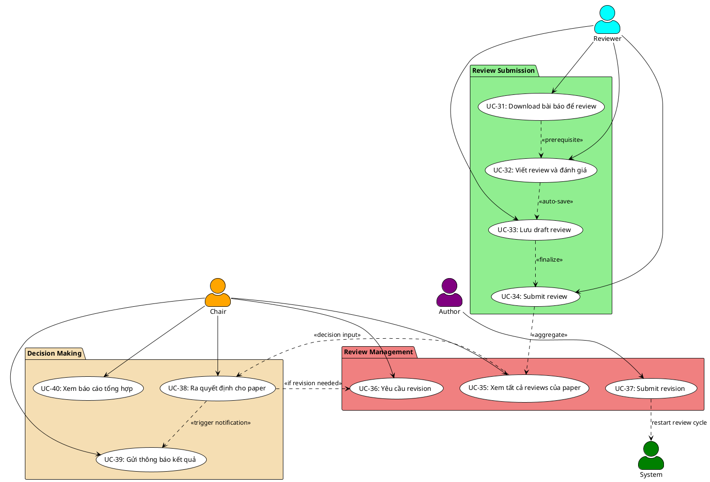

# NHÓM 4: REVIEW PROCESS & DECISION
## 10 Use Cases - Quy trình Phản biện và Quyết định

---

## 📊 Sơ đồ Use Case - Nhóm 4



---

## 📋 ĐẶC TẢ CHI TIẾT CÁC USE CASE

### UC-31: Download bài báo để review

**Mô tả**: Reviewer download file PDF của bài báo được phân công

**Tác nhân**: Reviewer

**Điều kiện tiên quyết**: 
- Reviewer đã accept assignment cho paper
- Assignment status = ACCEPTED hoặc IN_PROGRESS
- Paper file tồn tại trong hệ thống

**Điều kiện hậu tố**:
- File PDF được download
- Hệ thống log download activity
- Reviewer có thể bắt đầu đọc và đánh giá

**Luồng sự kiện chính**:
1. Reviewer truy cập trang "My Assignments"
2. Reviewer click vào paper cần review
3. Hệ thống hiển thị paper details page với:
   - Paper title (authors hidden nếu double-blind)
   - Abstract
   - Keywords
   - Track
   - Submission date
   - Review deadline
   - Review guidelines
4. Reviewer click nút "Download Paper"
5. Hệ thống verify quyền truy cập:
   - Check reviewer được assign cho paper này
   - Check assignment đã được accepted
6. Hệ thống ghi log download activity:
   - User ID
   - Paper ID
   - Download timestamp
   - IP address
7. Hệ thống trả về file PDF:
   - Tên file: `Paper_{paper_id}_Review.pdf` (ẩn authors info)
   - Có thể có watermark "Confidential - For Review Only"
8. Browser tự động download file
9. Reviewer có thể download supplementary materials (nếu có):
   - Source code
   - Datasets
   - Additional documents

**Luồng thay thế**:

*5a. Reviewer chưa accept assignment*:
- Hiển thị message: "Please accept assignment before downloading"
- Hiển thị "Accept Assignment" button
- Sau khi accept, cho phép download

*5b. Assignment đã bị declined/cancelled*:
- Hiển thị lỗi: "You no longer have access to this paper"
- Redirect về assignments list

*7a. File không tồn tại hoặc bị lỗi*:
- Hiển thị lỗi: "Paper file is temporarily unavailable"
- Gửi alert đến admin
- Cung cấp option "Contact Chair"

**Luồng bổ sung - Download Supplementary Materials**:
1. Reviewer click "Download Supplementary Files"
2. Hệ thống kiểm tra có files không
3. Nếu có: Download ZIP file chứa tất cả materials
4. Nếu không: Hiển thị "No supplementary materials provided"

**Luồng bổ sung - View History**:
1. Reviewer có thể xem download history
2. Hiển thị:
   - Lần download đầu tiên: [date]
   - Tổng số lần download: X
   - Last downloaded: [date]
3. Giúp reviewer track progress

---

### UC-32: Viết review và đánh giá

**Mô tả**: Reviewer đánh giá bài báo theo các tiêu chí đã định

**Tác nhân**: Reviewer

**Điều kiện tiên quyết**: 
- Reviewer đã download và đọc paper
- Assignment status = ACCEPTED hoặc IN_PROGRESS
- Chưa quá review deadline

**Điều kiện hậu tố**:
- Review draft được lưu (tự động hoặc thủ công)
- Reviewer có thể tiếp tục edit trước khi submit
- Progress được track

**Luồng sự kiện chính**:
1. Reviewer truy cập review form cho paper
2. Hệ thống hiển thị review form với các sections:

**Section 1: Summary Assessment**
- Overall Score (1-10 scale với descriptions):
  - 1-2: Strong Reject
  - 3-4: Reject
  - 5-6: Weak Reject / Borderline
  - 7-8: Accept
  - 9-10: Strong Accept
- Confidence Level (1-5):
  - 1: Not confident
  - 3: Moderately confident
  - 5: Very confident

**Section 2: Detailed Evaluation** (mỗi tiêu chí 1-5 stars + comments)
- Originality/Novelty
- Technical Quality
- Clarity of Presentation
- Relevance to Conference
- Experimental Validation (nếu applicable)
- Literature Review Quality

**Section 3: Strengths**
- Text area (min 100 words)
- List ít nhất 3 điểm mạnh
- Rich text editor hỗ trợ formatting

**Section 4: Weaknesses**
- Text area (min 100 words)
- List ít nhất 3 điểm yếu
- Constructive feedback

**Section 5: Detailed Comments**
- Main comments for authors (required, min 200 words)
- Line-by-line comments (optional)
- Suggestions for improvement

**Section 6: Confidential Comments for Chair**
- Comments chỉ Chair thấy (optional)
- Concerns về paper
- Special circumstances

**Section 7: Recommendation**
- Radio buttons:
  - Strong Accept
  - Accept
  - Weak Accept
  - Borderline
  - Weak Reject
  - Reject
  - Strong Reject

3. Reviewer điền từng section
4. Hệ thống auto-save mỗi 30 giây (UC-33)
5. Reviewer có thể:
   - Save Draft (manual save)
   - Preview Review (xem trước format)
   - Reset Form (clear all)
6. Hệ thống hiển thị completion progress:
   - "Review 60% complete"
   - Highlight missing required fields
7. Khi điền đủ required fields, enable "Submit Review" button

**Luồng thay thế**:

*3a. Load existing draft*:
- Nếu đã có draft: Load dữ liệu đã lưu
- Hiển thị "Last saved: [timestamp]"
- Cho phép continue editing

*4a. Auto-save failed*:
- Hiển thị warning icon
- Retry save sau 10 giây
- Nếu vẫn lỗi: Suggest manual save

*5a. Session timeout*:
- Hiển thị warning trước 5 phút
- Lưu draft trước khi logout
- Restore draft khi login lại

**Luồng bổ sung - Review Guidelines**:
1. Reviewer có thể xem guidelines bất kỳ lúc nào
2. Floating help icon bên cạnh mỗi field
3. Click để xem tips và examples
4. Conference-specific guidelines được hiển thị

**Luồng bổ sung - Quality Checks**:
1. Hệ thống check chất lượng review trước khi submit:
   - Strengths có ít nhất 100 words
   - Weaknesses có ít nhất 100 words
   - Main comments có ít nhất 200 words
   - Tất cả ratings được điền
2. Nếu không đạt: Hiển thị warnings
3. Reviewer có thể ignore warnings nhưng được khuyến khích complete

---

### UC-33: Lưu draft review

**Mô tả**: Hệ thống tự động hoặc reviewer thủ công lưu draft review

**Tác nhân**: Reviewer, System

**Điều kiện tiên quyết**: 
- Reviewer đang trong review form
- Có ít nhất một field được điền

**Điều kiện hậu tố**:
- Draft được lưu vào database
- Reviewer có thể tiếp tục sau
- Assignment status = IN_PROGRESS

**Luồng sự kiện chính - Auto Save**:
1. Reviewer đang điền review form
2. Sau 30 giây kể từ lần thay đổi cuối cùng:
   - System tự động lưu draft
3. Hệ thống gửi AJAX request với review data
4. Server validate và lưu vào database:
   - Lưu toàn bộ form data
   - Update timestamp
   - Maintain version history
5. Hiển thị visual feedback:
   - "Saved" icon với timestamp
   - Fade in/out animation
6. Nếu lưu thành công:
   - Icon màu xanh
   - "Last saved: Just now"
7. Continue auto-save cycle

**Luồng sự kiện chính - Manual Save**:
1. Reviewer click nút "Save Draft"
2. Hệ thống validate basic data
3. Hệ thống lưu draft
4. Hiển thị notification: "Draft saved successfully"
5. Update assignment status = IN_PROGRESS (nếu chưa)
6. Reviewer có thể:
   - Continue editing
   - Close và quay lại sau
   - Submit review

**Luồng thay thế**:

*Auto Save 3a. Network error*:
- Retry sau 10 giây
- Nếu vẫn lỗi: Hiển thị warning
- Suggest manual save
- Store data trong localStorage temporarily

*Auto Save 5a. Concurrent editing conflict*:
- Hiển thị warning: "Draft modified in another session"
- Cho phép reviewer chọn:
  - Keep current version
  - Load other version
  - Merge changes

*Manual Save 2a. Validation error*:
- Hiển thị errors (nếu có)
- Vẫn cho phép save draft
- Draft có thể incomplete

**Luồng bổ sung - Version History**:
1. Hệ thống lưu multiple versions
2. Reviewer có thể view history:
   - Click "View Versions"
   - Hiển thị timeline của drafts
   - Version 1: [timestamp]
   - Version 2: [timestamp]
3. Reviewer có thể restore old version:
   - Compare versions side-by-side
   - Choose version to restore

**Luồng bổ sung - Recovery**:
1. Nếu browser crash hoặc connection lost:
   - Data được lưu trong localStorage
2. Khi quay lại:
   - Hệ thống detect unsaved local data
   - Hiển thị prompt: "Recover unsaved changes?"
3. Reviewer chọn Recover hoặc Discard

---

### UC-34: Submit review

**Mô tả**: Reviewer hoàn tất và submit review chính thức

**Tác nhân**: Reviewer

**Điều kiện tiên quyết**: 
- Review draft đã được điền đủ required fields
- Chưa quá review deadline
- Assignment status = IN_PROGRESS

**Điều kiện hậu tố**:
- Review được submit với status = COMPLETED
- Không thể edit sau khi submit (trừ khi Chair cho phép)
- Chair nhận notification
- Author không thấy review cho đến notification date

**Luồng sự kiện chính**:
1. Reviewer đã điền xong review form
2. Reviewer click "Submit Review"
3. Hệ thống hiển thị confirmation modal với:
   - "Are you sure you want to submit this review?"
   - Warning: "You cannot edit after submission"
   - Summary của ratings
   - Checkbox: "I confirm this review is complete and accurate"
4. Reviewer review lại summary
5. Reviewer check confirmation box
6. Reviewer click "Confirm Submit"
7. Hệ thống validate toàn bộ review:
   - All required fields filled
   - Minimum word counts met
   - Ratings trong valid range
   - Recommendation selected
8. Hệ thống bắt đầu submit:
   - Update review status = COMPLETED
   - Update assignment status = COMPLETED
   - Lock review for editing
   - Record submission timestamp
   - Record reviewer ID
9. Hệ thống gửi confirmation email đến reviewer:
   - Thank you message
   - Review submission receipt
   - Paper details
   - Reminder về confidentiality
10. Hệ thống notify Chair:
    - "Review completed for Paper #{id}"
    - Progress update: "X/Y reviews completed"
11. Hệ thống update paper statistics:
    - Increment completed reviews count
    - Update average score (nếu đủ reviews)
12. Hiển thị success page:
    - "Review submitted successfully!"
    - "Thank you for your contribution"
    - Link to view submitted review (read-only)
    - Link back to assignments

**Luồng thay thế**:

*7a. Validation failed*:
1. Hệ thống list ra missing/invalid fields
2. Highlight các fields cần sửa
3. Không cho submit
4. Reviewer sửa lại và retry

*7b. Deadline passed during submission*:
1. Hiển thị warning: "Deadline has passed"
2. Vẫn cho phép submit (late submission)
3. Mark review as "Submitted Late"
4. Notify Chair về late submission

*8a. Database error*:
1. Hiển thị error: "Submission failed"
2. Draft vẫn được giữ
3. Suggest retry
4. Contact support nếu vẫn lỗi

**Luồng bổ sung - Preview Before Submit**:
1. Reviewer click "Preview" trước khi submit
2. Hệ thống render review trong format đẹp
3. Hiển thị exactly như Chair sẽ thấy
4. Reviewer có thể:
   - Export as PDF
   - Go back to edit
   - Proceed to submit

**Luồng bổ sung - Post-Submission Edit (Special Case)**:
1. Nếu Chair enable "Allow edit after submission"
2. Reviewer có thể request edit:
   - Click "Request Edit Permission"
   - Nhập reason
3. Chair approve/deny request
4. Nếu approved:
   - Review unlocked tạm thời
   - Time limit để edit (24 hours)
   - Must re-submit sau khi edit

---

### UC-35: Xem tất cả reviews của paper

**Mô tả**: Chair xem tất cả reviews đã submit cho một paper

**Tác nhân**: Chair

**Điều kiện tiên quyết**: 
- Chair có quyền quản lý conference
- Paper đã có ít nhất 1 review completed

**Điều kiện hậu tố**:
- Hiển thị tổng hợp tất cả reviews
- Chair có đủ thông tin để ra quyết định
- Có thể export reviews

**Luồng sự kiện chính**:
1. Chair truy cập paper management dashboard
2. Chair click vào một paper
3. Hệ thống hiển thị paper overview với:
   - Paper details (title, authors, abstract)
   - Submission info
   - Review statistics:
     - Total reviewers assigned: X
     - Reviews completed: Y/X
     - Average score: Z/10
     - Recommendation distribution
4. Chair click tab "Reviews"
5. Hệ thống hiển thị tất cả reviews đã completed:

**Mỗi review hiển thị**:
- Reviewer name hoặc "Reviewer #N" (nếu blind review)
- Submitted date
- Overall score với visual indicator (color bar)
- Confidence level
- Detailed ratings (stars)
- Recommendation badge (color-coded):
  - Green: Strong Accept / Accept
  - Yellow: Weak Accept / Borderline
  - Red: Weak Reject / Reject / Strong Reject

6. Chair có thể expand mỗi review để xem chi tiết:
   - Strengths
   - Weaknesses
   - Detailed comments
   - Confidential comments (chỉ Chair thấy)
7. Hệ thống hiển thị aggregated analysis:
   - Score distribution chart
   - Common themes trong strengths
   - Common themes trong weaknesses
   - Consensus level (high/medium/low)
8. Chair có thể:
   - Compare reviews side-by-side
   - Export all reviews (PDF/Word)
   - Request additional review (nếu cần)
   - Make decision (UC-38)

**Luồng thay thế**:

*4a. Chưa có review nào completed*:
- Hiển thị "No reviews submitted yet"
- Hiển thị pending assignments:
  - Reviewer names
  - Assignment dates
  - Deadlines
- Chair có thể send reminder

*5a. Reviews có conflicts lớn*:
- Hệ thống highlight conflict:
  - "Reviews show significant disagreement"
  - Score variance: High
- Suggest:
  - Request additional review
  - Discuss with reviewers
  - Meta-review

**Luồng bổ sung - Review Quality Check**:
1. Hệ thống analyze review quality:
   - Length của comments
   - Specificity (generic vs detailed)
   - Consistency (scores vs comments)
2. Flag low-quality reviews:
   - Too short comments
   - Contradictory scores
   - Generic feedback
3. Chair có thể:
   - Request revision from reviewer
   - Contact reviewer for clarification
   - Discard review (extreme cases)

**Luồng bổ sung - Anonymous Comments**:
1. Chair có thể toggle anonymity:
   - "Show reviewer names" (default: hidden)
   - Nếu show: Hiển thị tên reviewers
   - Nếu hide: Hiển thị "Reviewer A, B, C"
2. Bảo vệ reviewer anonymity khi share với co-chairs

---

### UC-36: Yêu cầu revision

**Mô tả**: Chair yêu cầu authors sửa bài dựa trên reviews

**Tác nhân**: Chair

**Điều kiện tiên quyết**: 
- Paper đã có đủ reviews
- Chair quyết định paper cần revision (không accept/reject ngay)
- Reviews có constructive feedback

**Điều kiện hậu tố**:
- Paper status = REVISION_REQUIRED
- Authors nhận notification với review feedback
- Revision deadline được set
- Authors có thể submit revised version

**Luồng sự kiện chính**:
1. Chair đang xem reviews của paper (UC-35)
2. Chair quyết định paper có potential nhưng cần improvements
3. Chair click "Request Revision"
4. Hệ thống hiển thị revision request form:

**Revision Details**:
- Revision Type:
  - Minor Revision (small changes)
  - Major Revision (significant changes)
- Revision Deadline (date picker):
  - Suggested: 2 weeks (minor) / 4 weeks (major)
  - Có thể custom
- Reviews to Share:
  - Select which reviews to share with authors
  - Option: Anonymize reviewer names
  - Option: Share confidential comments (No by default)

**Chair's Instructions**:
- Summary of required changes (required, min 100 words)
- Specific points to address (bullet list)
- Additional guidelines
- Expected improvements

**Re-review Options**:
- Same reviewers review revision? (Yes/No)
- Add new reviewers? (Yes/No)
- Full review or just check changes? (Radio)

5. Chair fills in revision details
6. Chair click "Send Revision Request"
7. Hệ thống validate revision request
8. Hệ thống update paper status = REVISION_REQUIRED
9. Hệ thống prepare revision package cho authors:
   - Compile selected reviews
   - Anonymize nếu cần
   - Add Chair's instructions
   - Include revision guidelines
10. Hệ thống send notification email đến all authors:
    - Subject: "Revision Required for Paper #{id}"
    - Reviews attached (PDF)
    - Chair's instructions
    - Revision deadline
    - Submission link
11. Hệ thống set revision deadline trong database
12. Hệ thống create revision tracking record
13. Hiển thị confirmation: "Revision request sent successfully"

**Luồng thay thế**:

*3a. Reviews quá negative*:
- Hệ thống warning: "Reviews mostly recommend rejection"
- Suggest Chair consider reject instead
- Chair có thể override và still request revision

*7a. Deadline quá gần notification date*:
- Warning: "Revision deadline is very close to notification date"
- Suggest extend notification date
- Chair confirm hoặc adjust deadline

*10a. Email gửi failed*:
- Hệ thống retry
- Log error
- Notify Chair về failed emails
- Provide alternative: Download package và send manually

**Luồng bổ sung - Conditional Acceptance**:
1. Chair có thể mark revision as "Conditional Accept"
2. Điều kiện:
   - Paper will be accepted IF revisions address all points
   - Otherwise will be rejected
3. Clear expectation cho authors
4. Faster turnaround cho minor issues

**Luồng bổsung - Revision Reminder**:
1. Hệ thống auto-send reminders:
   - 7 days before deadline
   - 3 days before deadline
   - 1 day before deadline
2. Chair có thể manually send reminder anytime
3. Track reminder history

---

### UC-37: Submit revision

**Mô tả**: Authors submit bản revision theo yêu cầu của Chair

**Tác nhân**: Author

**Điều kiện tiên quyết**: 
- Paper status = REVISION_REQUIRED
- Author đã nhận revision request
- Chưa quá revision deadline

**Điều kiện hậu tố**:
- Revised paper được upload
- Response letter được submit
- Paper status = REVISION_SUBMITTED
- Re-review process bắt đầu (nếu applicable)

**Luồng sự kiện chính**:
1. Author nhận email revision request
2. Author login và truy cập paper details
3. Hệ thống hiển thị revision status page:
   - Original reviews (có thể download)
   - Chair's instructions
   - Revision deadline với countdown
   - Required changes checklist
4. Author click "Submit Revision"
5. Hệ thống hiển thị revision submission form:

**Upload Revised Paper**:
- File upload (PDF, max 10MB) - required
- Revision version được auto-increment: v2, v3...

**Response to Reviews**:
- Response letter (PDF hoặc text) - required
- Point-by-point response template:
  - Reviewer 1 Comment 1: [quote]
  - Our Response: [detailed response]
  - Changes Made: [specific changes]
- Minimum 500 words required

**Track Changes Document** (optional but recommended):
- Upload version với tracked changes
- Helps reviewers see exact modifications

**Summary of Changes**:
- Brief summary (max 500 words)
- Highlight major improvements
- List new sections/data added

**Cover Letter to Chair** (optional):
- Additional context
- Explanations for any points not addressed

6. Author fills in all sections
7. Author upload files:
   - Revised paper PDF
   - Response letter
   - Track changes version (optional)
8. Author click "Submit Revision"
9. Hệ thống validate:
   - All required files uploaded
   - Response letter meets minimum length
   - Files are valid PDFs
10. Hệ thống update database:
    - Save revised paper file
    - Save response documents
    - Update paper status = REVISION_SUBMITTED
    - Increment version number
    - Record submission timestamp
11. Hệ thống notify Chair:
    - "Revision submitted for Paper #{id}"
    - Links to revised paper và response
12. Hệ thống notify reviewers (nếu re-review enabled):
    - "Revised paper ready for re-review"
    - Assignment notification
13. Hệ thống send confirmation email to authors:
    - Revision submission receipt
    - What happens next
    - Expected timeline
14. Hiển thị success page:
    - "Revision submitted successfully!"
    - Next steps
    - Track revision status link

**Luồng thay thế**:

*2a. Deadline đã qua*:
- Hiển thị "Revision deadline has passed"
- Author có thể:
  - Request extension (với justification)
  - Submit anyway (late submission)
- Chair decide accept late revision hay không

*9a. File too large*:
- Error: "File exceeds 10MB limit"
- Suggest:
  - Compress PDF
  - Reduce image quality
  - Split into main + supplementary

*9b. Response letter quá ngắn*:
- Warning: "Response letter seems incomplete"
- Suggest expand to adequately address all points
- Cho phép submit nhưng flagged

**Luồng bổ sung - Request Deadline Extension**:
1. Author click "Request Extension"
2. Form hiển thị:
   - Current deadline
   - Requested new deadline
   - Justification (required)
3. Submit request
4. Chair receives notification
5. Chair approve/deny:
   - If approved: Update deadline
   - If denied: Notify author
6. Author notified về decision

**Luồng bổ sung - Partial Submission**:
1. Author có thể save draft revision
2. Upload files incrementally
3. System auto-save progress
4. Can resume later
5. Must complete all sections before final submit

---

### UC-38: Ra quyết định cho paper

**Mô tả**: Chair đưa ra quyết định cuối cùng (Accept/Reject) cho paper

**Tác nhân**: Chair

**Điều kiện tiên quyết**: 
- Paper đã có đủ số lượng reviews completed
- Chair đã review tất cả reviews và revisions (nếu có)
- Chưa quá notification deadline

**Điều kiện hậu tố**:
- Paper có final decision: ACCEPTED hoặc REJECTED
- Decision không thể thay đổi (immutable)
- Authors sẽ được notify vào notification date
- Statistics được update

**Luồng sự kiện chính**:
1. Chair truy cập paper details page
2. Chair đã xem tất cả reviews (UC-35)
3. Chair click "Make Decision"
4. Hệ thống hiển thị decision form với:

**Review Summary**:
- Average score: X/10
- Score distribution chart
- Recommendation breakdown:
  - Strong Accept: X
  - Accept: Y
  - Borderline: Z
  - Reject: W
- Consensus indicator: High/Medium/Low

**Paper Information**:
- Title, authors
- Version history (original, revisions)
- Response to reviews (if any)

**Decision Options** (radio buttons):
- **Accept** (paper will be included in conference)
- **Reject** (paper will not be accepted)

**Decision Justification** (required for both):
- Text area (min 200 words)
- Explain reasoning
- Reference specific review points
- Provide constructive feedback

**For ACCEPT decisions**:
- Acceptance type:
  - Full Paper
  - Short Paper
  - Poster
- Presentation format:
  - Oral presentation
  - Poster session
  - Both
- Conditions (if any):
  - Minor revisions required for camera-ready
  - Specific points to address

**For REJECT decisions**:
- Rejection reason (select multiple):
  - Poor quality
  - Not relevant to conference
  - Insufficient novelty
  - Methodological issues
  - Poor presentation
  - Other (specify)
- Encouragement to submit elsewhere (optional)
- Suggestions for improvement

5. Chair makes decision và fills justification
6. Chair click "Submit Decision"
7. Hệ thống hiển thị final confirmation:
   - "This decision is final and cannot be changed"
   - Summary of decision
   - Checkbox: "I confirm this decision is final"
8. Chair confirms
9. Hệ thống validates decision
10. Hệ thống update paper:
    - Set status = ACCEPTED hoặc REJECTED
    - Save decision justification
    - Record decision date
    - Record Chair who made decision
    - Lock paper for further changes
11. Hệ thống queue notification:
    - Notification sẽ gửi vào notification_deadline
    - Không gửi ngay
12. Hệ thống update conference statistics:
    - Total decisions made
    - Acceptance rate
    - Track-wise statistics
13. Hiển thị success message:
    - "Decision recorded successfully"
    - "Authors will be notified on [notification_date]"
14. Hệ thống log decision trong activity log

**Luồng thay thế**:

*4a. Reviews có conflict cao*:
- Warning banner: "Reviews show significant disagreement"
- Suggest:
  - Request meta-review
  - Get additional review
  - Discuss with PC members
- Chair có thể proceed anyway với detailed justification

*4b. Paper có plagiarism concern*:
- Flag hiển thị prominently
- Link to plagiarism report
- Chair MUST address trong decision justification
- Suggest reject nếu plagiarism confirmed

*9a. Justification quá ngắn*:
- Error: "Justification must be at least 200 words"
- Explain: "Authors deserve detailed feedback"
- Chair phải expand justification

**Luồng bổ sung - Borderline Cases**:
1. Chair có thể mark paper as "Borderline"
2. System suggest:
   - Discuss with PC
   - Request shepherd review
   - Compare with other borderline papers
3. Chair makes final call after consultation
4. Record consultation notes

**Luồng bổ sung - Conditional Accept**:
1. Chair select "Conditional Accept"
2. Specify conditions clearly:
   - "Accept if authors address points A, B, C"
   - Set mini-revision deadline (short)
3. Authors submit addressing changes
4. Chair verify và confirm final accept
5. If not addressed: Convert to reject

**Luồng bổ sung - Decision Appeal**:
1. After notification, authors có thể appeal
2. Chair review appeal:
   - New evidence presented?
   - Procedural error?
   - Misunderstanding of reviews?
3. Chair decide:
   - Uphold decision (most cases)
   - Reconsider (rare)
4. Log appeal và outcome

---

### UC-39: Gửi thông báo kết quả

**Mô tả**: Hệ thống gửi thông báo kết quả (accept/reject) đến authors

**Tác nhân**: System (automated), Chair (can trigger manually)

**Điều kiện tiên quyết**: 
- Đã đến notification_deadline của conference
- Papers đã có final decisions
- Notification chưa được gửi

**Điều kiện hậu tố**:
- Authors nhận email notification
- Authors có thể xem decision và reviews
- Accepted papers có instructions cho camera-ready
- Rejected papers có feedback

**Luồng sự kiện chính - Automated**:
1. System scheduler chạy vào notification_deadline (configured time)
2. Hệ thống query tất cả papers:
   - Có final decision (ACCEPTED hoặc REJECTED)
   - Chưa gửi notification
3. Hệ thống prepare notifications theo batches
4. Cho mỗi paper:

**ACCEPTED papers**:
Email content:
- Subject: "Congratulations! Your paper has been accepted"
- Congratulations message
- Paper title và ID
- Decision: ACCEPTED
- Presentation format (Oral/Poster)
- Chair's comments
- Reviews (full content)
- Next steps:
  - Camera-ready deadline
  - Camera-ready guidelines
  - Registration information
  - Presentation guidelines
- Important dates reminder

**REJECTED papers**:
Email content:
- Subject: "Decision on your paper submission"
- Respectful opening
- Paper title và ID
- Decision: NOT ACCEPTED
- Chair's justification
- Reviews (constructive feedback)
- Encouragement:
  - Suggestions for improvement
  - Encouragement to submit elsewhere
  - Thank you for submission
- Conference information for future

5. Hệ thống gửi emails (throttled để tránh spam filters):
   - Send batch of 50 emails
   - Wait 1 minute
   - Continue next batch
6. Hệ thống track email delivery:
   - Sent successfully
   - Failed (retry)
   - Bounced
7. Hệ thống update notification status cho mỗi paper
8. Hệ thống send summary report đến Chair:
   - Total notifications sent: X
   - Accepted: Y
   - Rejected: Z
   - Failed deliveries: W

**Luồng sự kiện chính - Manual Trigger**:
1. Chair truy cập notification management
2. Chair xem preview của notifications
3. Chair có thể:
   - Send test notification (to self)
   - Preview email templates
   - Edit email templates (with limitations)
4. Chair click "Send All Notifications Now"
5. Confirmation: "This will notify all authors"
6. Chair confirms
7. Process tương tự automated flow

**Luồng thay thế**:

*5a. Email delivery failed*:
- System retry 3 times
- If still failed:
  - Log error
  - Notify Chair
  - Provide list of failed emails
  - Chair send manually

*5b. Notification date chưa đến*:
- System chưa send
- Chair có thể:
  - Wait until scheduled date
  - Send early (với confirmation)
  - Send to selected papers only

**Luồng bổ sung - Staggered Notification**:
1. Chair có thể chọn staggered sending:
   - Send accepts first (Day 1)
   - Send rejects later (Day 2)
2. Giúp handle registration rush
3. More time để prepare responses

**Luồng bổ sung - Personalized Messages**:
1. Chair có thể add personal notes cho specific papers:
   - Exceptional papers: Extra congratulations
   - Borderline accepts: Conditional notes
   - Strong rejects with potential: Encouragement
2. Personal notes appended to standard email

**Luồng bổ sung - Post-Notification Actions**:
1. Sau khi send notifications:
   - Enable author access to reviews
   - Enable camera-ready upload (accepts)
   - Enable appeal process (rejects)
   - Update conference website statistics
2. Monitor author responses và questions
3. Prepare FAQ based on common questions

---

### UC-40: Xem báo cáo tổng hợp

**Mô tả**: Chair xem báo cáo tổng hợp về toàn bộ review process

**Tác nhân**: Chair, Admin

**Điều kiện tiên quyết**: 
- Conference đã có papers và reviews
- Chair có quyền truy cập

**Điều kiện hậu tố**:
- Hiển thị comprehensive statistics và insights
- Chair có overview đầy đủ về conference
- Có thể export reports

**Luồng sự kiện chính**:
1. Chair truy cập "Reports & Analytics"
2. Hệ thống hiển thị dashboard với multiple sections:

**Section 1: Submission Statistics**
- Total submissions: X
- By track:
  - Track A: Y papers
  - Track B: Z papers
- By type:
  - Full papers: A
  - Short papers: B
  - Posters: C
- Submission timeline chart
- Geographic distribution (by author country)

**Section 2: Review Statistics**
- Total reviewers: X
- Reviewers who completed assignments: Y (Y/X %)
- Total review assignments: A
- Completed reviews: B (B/A %)
- Average reviews per paper: C
- Average papers per reviewer: D
- Review completion timeline
- Overdue reviews: E
- Review quality metrics:
  - Average review length
  - Reviews flagged as low quality

**Section 3: Decision Statistics**
- Papers with decisions: X
- Accepted: Y (Y/X % acceptance rate)
- Rejected: Z
- Pending decisions: W
- Acceptance by track (chart)
- Acceptance by paper type
- Decision timeline

**Section 4: Score Distribution**
- Average score across all papers: X/10
- Score distribution histogram
- By track comparisons
- By reviewer comparisons (identify tough/lenient reviewers)

**Section 5: Review Process Metrics**
- Average time to complete review: X days
- Fastest review: Y days
- Slowest review: Z days
- Papers with conflicts: W
- Papers requiring revision: V
- Revision success rate: R%

**Section 6: Reviewer Performance**
- Top reviewers (most reviews completed)
- Most reliable reviewers (on-time delivery)
- Reviewers needing follow-up
- Reviewer expertise coverage map
- Reviewer feedback scores (if collected)

**Section 7: Quality Indicators**
- Inter-reviewer agreement (Kappa score)
- Review conflicts (high score variance)
- Papers with unanimous decisions
- Papers with split decisions
- Plagiarism cases detected: X

**Section 8: Comparison Metrics**
- Compare với previous years (nếu có)
- Benchmark với similar conferences
- Trends over time

3. Chair có thể interact với dashboard:
   - Filter by date range
   - Filter by track
   - Drill down vào specific metrics
   - Click charts để xem details

4. Chair có thể export reports:
   - Full report (PDF) - comprehensive
   - Executive summary (PDF) - high-level
   - Data export (Excel/CSV) - raw data
   - Charts (PNG/SVG) - for presentations

5. Chair có thể share reports:
   - Share with co-chairs
   - Share with PC members
   - Share with conference organizers
   - Public statistics (limited data)

**Luồng thay thế**:

*2a. Không đủ data*:
- Hiển thị: "Insufficient data for some metrics"
- Show available metrics only
- Hide sections without data

*2b. Conference chưa bắt đầu review*:
- Show submission statistics only
- Reviewer recruitment stats
- Progress towards review phase

**Luồng bổ sung - Custom Reports**:
1. Chair click "Create Custom Report"
2. Select metrics to include:
   - Choose from available metrics
   - Set date ranges
   - Select filters
3. Preview report
4. Save template cho future use
5. Generate và export

**Luồng bổ sung - Automated Reporting**:
1. Chair setup auto-generated reports:
   - Weekly progress reports
   - Milestone reports (deadlines)
   - End-of-phase reports
2. Schedule email delivery
3. Define recipients
4. Reports generated và sent automatically

**Luồng bổ sung - Insights & Recommendations**:
1. System analyze data và provide insights:
   - "Track X has lower acceptance rate than average"
   - "Reviewer Y consistently scores lower than peers"
   - "Review completion accelerating towards deadline"
2. Actionable recommendations:
   - "Consider inviting more reviewers for Track Z"
   - "Send reminder to W reviewers"
   - "X papers need decisions before notification date"
3. Chair có thể take action directly từ insights

**Luồng bổ sung - Reviewer Recognition**:
1. Identify outstanding reviewers:
   - Completed all assignments on time
   - High-quality reviews
   - Reliable và responsive
2. Generate recognition certificates
3. Add to reviewer database với high rating
4. Consider for future conferences

---

## 📊 TỔNG KẾT NHÓM 4

### Thống kê:
- **Tổng số UC**: 10
- **Actors**: Reviewer (4 UC), Chair (5 UC), Author (1 UC), System (1 UC - automated)
- **Database tables**: phanbien, reviewer_assignments, baibao, paper_versions, user_notifications, activity_logs, decision_records

### Workflow chính:
```
Reviewer → UC-31 (Download paper) → UC-32 (Write review) → UC-33 (Save draft) → UC-34 (Submit)
Chair → UC-35 (View all reviews) → UC-38 (Make decision)
If revision needed → UC-36 (Request revision) → Author UC-37 (Submit revision) → Back to review
System → UC-39 (Send notifications on notification_date)
Chair → UC-40 (View comprehensive reports)
```

### Mối quan hệ giữa các UC:
- UC-31 → UC-32 (prerequisite): Must download before reviewing
- UC-32 → UC-33 (continuous): Auto-save while writing
- UC-33 → UC-34 (finalize): Draft leads to submission
- UC-34 → UC-35 (aggregate): Reviews collected for Chair
- UC-35 → UC-38 (input): Reviews inform decision
- UC-38 → UC-36 (conditional): Decision may require revision
- UC-36 → UC-37 (trigger): Request triggers author action
- UC-37 → System (restart): Revision restarts review cycle
- UC-38 → UC-39 (trigger): Decision triggers notification
- UC-40 (standalone): Comprehensive reporting anytime

### Key Business Rules:

**Review Submission**:
- Minimum requirements:
  - Strengths: 100 words
  - Weaknesses: 100 words
  - Main comments: 200 words
  - All ratings filled
- Auto-save every 30 seconds
- Version history maintained
- Cannot edit after submission (unless Chair allows)

**Review Quality**:
- Detailed evaluation required (1-5 stars per criterion)
- Constructive feedback mandatory
- Confidence level must be stated
- Line-by-line comments encouraged
- Plagiarism check required

**Decision Making**:
- Must have minimum 3 reviews (configurable)
- Decision justification minimum 200 words
- Decisions are immutable once made
- Both ACCEPT and REJECT need detailed feedback
- Conditional accepts allowed

**Revision Process**:
- Two types: Minor (2 weeks) / Major (4 weeks)
- Response letter required (min 500 words)
- Point-by-point response format
- Can request deadline extension
- Late submissions flagged

**Notification**:
- Sent on notification_deadline (automated)
- All papers notified simultaneously
- Includes reviews và decision justification
- Accepted papers get camera-ready instructions
- Rejected papers get improvement suggestions

**Reporting**:
- Real-time dashboard updates
- Inter-reviewer agreement metrics
- Acceptance rate tracking
- Quality indicators
- Reviewer performance analytics

### Review Timeline:
```
Assignment → Download Paper (UC-31)
  ↓
Write Review (UC-32) ← Auto-save (UC-33)
  ↓
Submit Review (UC-34)
  ↓
Chair Views Reviews (UC-35)
  ↓
Decision Point (UC-38)
  ├─→ Accept → Notification (UC-39)
  ├─→ Reject → Notification (UC-39)
  └─→ Revision Required (UC-36)
       ↓
       Author Submit Revision (UC-37)
       ↓
       Re-review cycle
```

### Score Mapping:
- 9-10: Strong Accept
- 7-8: Accept
- 5-6: Borderline / Weak Accept
- 3-4: Reject
- 1-2: Strong Reject

### Confidentiality Levels:
1. **Public** (after notification): Paper title, decision
2. **Authors** (after notification): Reviews, scores, decision
3. **Reviewers**: Paper content (no authors if double-blind)
4. **Chair**: Everything including confidential comments
5. **Admin**: Metadata và statistics

---

**File này là phần 4 trong series đặc tả Use Case. Tiếp theo: Nhóm 5 - Admin & System Management...**
