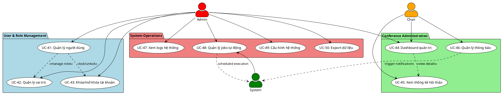

# NHÓM 5: ADMIN & SYSTEM MANAGEMENT
## 10 Use Cases - Quản trị Hệ thống

---

## 📊 Sơ đồ Use Case - Nhóm 5



---

## 📋 ĐẶC TẢ CHI TIẾT CÁC USE CASE

### UC-41: Quản lý người dùng

**Mô tả**: Admin quản lý tất cả người dùng trong hệ thống

**Tác nhân**: Admin

**Điều kiện tiên quyết**: 
- Admin đã đăng nhập
- Có quyền ADMIN role

**Điều kiện hậu tố**:
- Thông tin người dùng được xem/cập nhật/xóa
- Logs được ghi lại cho tất cả thao tác
- Người dùng nhận thông báo (nếu có thay đổi)

**Luồng sự kiện chính**:
1. Admin truy cập trang "User Management"
2. Hệ thống hiển thị danh sách tất cả users với thông tin:
   - ID
   - Full name
   - Email
   - Organization
   - Registration date
   - Last login
   - Status (Active/Locked/Pending)
   - Total roles
   - Total papers (submitted/reviewed)
3. Admin có thể search users theo:
   - Email
   - Name
   - Organization
   - Role
4. Admin có thể filter users theo:
   - Status (Active/Locked/Pending)
   - Registration date range
   - Last login date
   - Has roles or not
5. Admin có thể sort theo bất kỳ column nào
6. Admin click vào một user để xem chi tiết

**User Detail View**:
1. Hệ thống hiển thị profile đầy đủ:
   - Personal information
   - Contact details
   - Organization info
   - Account created date
   - Email verification status
   - Last login timestamp
   - Login history (recent 10 logins)

2. Hệ thống hiển thị roles & permissions:
   - List all conferences user participated
   - Roles in each conference (Author/Reviewer/Chair)
   - Assignment counts
   - Activity summary

3. Hệ thống hiển thị activity logs:
   - Recent actions
   - Papers submitted
   - Reviews completed
   - Conferences organized

4. Admin có thể thực hiện actions:
   - **Edit Profile**: Sửa thông tin cơ bản
   - **Reset Password**: Gửi link reset password
   - **Verify Email**: Manually verify email
   - **Lock Account**: Khóa tài khoản (UC-43)
   - **Delete Account**: Xóa tài khoản (với confirmation)
   - **View Full History**: Xem toàn bộ activity log

**Edit User Profile**:
1. Admin click "Edit Profile"
2. Form hiển thị với các fields:
   - Full name
   - Email (với warning nếu thay đổi)
   - Phone
   - Organization
   - Position/Title
   - Bio
3. Admin update thông tin
4. Admin click "Save Changes"
5. Hệ thống validate data
6. Hệ thống update user record
7. Hệ thống log thay đổi
8. Nếu email thay đổi: Gửi verification email mới
9. Hiển thị success message

**Delete User Account**:
1. Admin click "Delete Account"
2. Hệ thống hiển thị confirmation modal:
   - Warning: "This action cannot be undone"
   - List impacts:
     - X papers will lose this author
     - Y reviews will be marked as deleted
     - Z role assignments will be removed
   - Checkbox: "I understand the consequences"
3. Admin có thể chọn:
   - **Soft Delete**: Mark as deleted (keep data)
   - **Hard Delete**: Permanently remove (anonymize data)
4. Admin confirm deletion
5. Hệ thống execute deletion:
   - Soft: Set status = DELETED, anonymize sensitive data
   - Hard: Remove user record, cascade updates
6. Hệ thống log deletion action
7. Hiển thị confirmation

**Luồng thay thế**:

*2a. Hệ thống có nhiều users (>1000)*:
- Sử dụng pagination (50 users/page)
- Lazy loading khi scroll
- Quick search để filter nhanh

*Edit 5a. Email đã tồn tại*:
- Error: "Email already exists"
- Không cho update
- Admin phải chọn email khác

*Delete 5a. User có critical data*:
- Warning: "User is Chair of active conferences"
- Suggest transfer ownership trước
- Require explicit override

**Luồng bổ sung - Bulk Operations**:
1. Admin select multiple users (checkbox)
2. Admin click "Bulk Actions"
3. Options:
   - Send email to selected
   - Export selected users
   - Lock/Unlock selected
   - Delete selected
4. Hệ thống confirm action
5. Execute bulk operation
6. Show results: X succeeded, Y failed

**Luồng bổ sung - User Activity Timeline**:
1. Admin click "View Timeline"
2. Hệ thống hiển thị chronological timeline:
   - Account created
   - Email verified
   - First login
   - Joined conferences
   - Submitted papers
   - Completed reviews
   - Role changes
3. Visual timeline với dates và icons
4. Click vào event để xem details

---

### UC-42: Quản lý vai trò

**Mô tả**: Admin quản lý roles và permissions của users trong conferences

**Tác nhân**: Admin, Chair (limited)

**Điều kiện tiên quyết**: 
- Admin/Chair đã đăng nhập
- Có quyền quản lý roles

**Điều kiện hậu tố**:
- Roles được thêm/sửa/xóa
- Permissions được cập nhật
- Users nhận notification về role changes
- System logs ghi lại thay đổi

**Luồng sự kiện chính - Admin View**:
1. Admin truy cập "Role Management"
2. Hệ thống hiển thị role overview:

**System-wide Roles** (global):
- **ADMIN**: Full system access
- **USER**: Basic user (default)
- Total users per role

**Conference-specific Roles**:
- **CHAIR**: Conference organizer
- **REVIEWER**: Paper reviewer
- **AUTHOR**: Paper submitter
- Statistics per conference

3. Admin có thể view role matrix:
   - Users (rows) x Conferences (columns)
   - Cell hiển thị roles của user trong conference
   - Color-coded: Chair (Orange), Reviewer (Cyan), Author (Purple)

4. Admin click "Assign Role" để add new role
5. Form hiển thị:
   - Select User (search/dropdown)
   - Select Conference
   - Select Role (CHAIR/REVIEWER/AUTHOR)
   - Start date (default: now)
   - End date (optional)
   - Notes (optional)
6. Admin submit role assignment
7. Hệ thống validate:
   - User exists
   - Conference exists
   - Role not duplicated
   - Valid date range
8. Hệ thống create role assignment
9. Hệ thống trigger events:
   - Send notification to user
   - Update user permissions
   - Log role assignment
10. Success message displayed

**View User Roles**:
1. Admin search for specific user
2. Hệ thống hiển thị all roles của user:
   - Conference name
   - Role type
   - Assigned date
   - Assigned by
   - Status (Active/Expired)
   - Actions (Edit/Delete)
3. Admin có thể:
   - Add new role
   - Modify existing role
   - Remove role
   - Extend role duration

**Remove Role**:
1. Admin click "Remove" trên một role
2. Confirmation modal:
   - "Remove [Role] from [User] in [Conference]?"
   - Warning về impacts
   - Reason (required)
3. Admin confirm
4. Hệ thống remove role assignment
5. Hệ thống cleanup:
   - Revoke permissions
   - Notify user
   - Update conference stats
6. Log removal action

**Luồng sự kiện chính - Chair View**:
1. Chair truy cập "Manage Reviewers" hoặc "Manage Authors"
2. Hệ thống hiển thị roles ONLY for Chair's conferences
3. Chair có thể:
   - View all reviewers/authors
   - Add reviewer role (through invitation UC-23)
   - Remove reviewer role (with reason)
   - View role history
4. Chair KHÔNG thể:
   - Assign CHAIR role
   - Assign ADMIN role
   - Access other conferences' roles

**Luồng thay thế**:

*7a. Role đã tồn tại*:
- Error: "User already has this role in this conference"
- Suggest: "Extend duration or modify existing role"

*7b. Conflicting roles*:
- Warning: "User is already AUTHOR in this conference"
- Confirm: "Add REVIEWER role as well?"
- Explain dual roles allowed

*Remove 4a. Role có dependencies*:
- Warning: "User has pending assignments as REVIEWER"
- Options:
  - Cancel assignments first
  - Transfer assignments to others
  - Override and remove (force)

**Luồng bổ sung - Role History**:
1. Admin click "View History" cho một user
2. Hệ thống hiển thị timeline:
   - All roles ever assigned
   - Assignment dates
   - Removed dates (if removed)
   - Who assigned/removed
   - Reasons for changes
3. Export history as PDF

**Luồng bổ sung - Bulk Role Assignment**:
1. Admin upload CSV file:
   - Columns: Email, Conference, Role
2. Hệ thống validate file
3. Preview assignments:
   - Valid: X users
   - Invalid: Y users (with errors)
4. Admin confirm
5. Hệ thống process batch:
   - Assign roles
   - Send notifications
   - Log all actions
6. Report: X succeeded, Y failed

**Luồng bổ sung - Role Healing Job**:
1. System auto-run nightly job
2. Check for inconsistencies:
   - Authors without submissions
   - Reviewers without assignments (after 6 months)
   - Expired roles still active
3. Generate report for Admin
4. Suggest cleanup actions
5. Admin can approve auto-cleanup

---

### UC-43: Khóa/mở khóa tài khoản

**Mô tả**: Admin khóa hoặc mở khóa tài khoản người dùng

**Tác nhân**: Admin

**Điều kiện tiên quyết**: 
- Admin đã đăng nhập
- User account tồn tại
- User không phải là ADMIN (không tự khóa admin)

**Điều kiện hậu tố**:
- Account status được cập nhật
- User nhận email notification
- User không thể login (nếu locked)
- System log ghi lại action

**Luồng sự kiện chính - Lock Account**:
1. Admin đang ở user detail page
2. Admin click "Lock Account"
3. Hệ thống hiển thị lock confirmation modal:
   - User info (name, email)
   - Current status
   - Warning: "User will not be able to login"
   - Reason field (required):
     - Violation of terms
     - Suspicious activity
     - User request
     - Security concern
     - Other (specify)
   - Duration:
     - Temporary (specify end date)
     - Permanent
   - Notify user: Yes/No checkbox
4. Admin fills reason và duration
5. Admin click "Confirm Lock"
6. Hệ thống validate lock action
7. Hệ thống update user status = LOCKED
8. Hệ thống save lock metadata:
   - Locked by (Admin ID)
   - Locked at (timestamp)
   - Reason
   - Duration/End date
9. Hệ thống revoke active sessions:
   - Logout user from all devices
   - Invalidate all tokens
10. Nếu "Notify user" checked:
    - Send email explaining lock
    - Include reason
    - Include unlock date (if temporary)
    - Include contact info for appeal
11. Hệ thống log lock action
12. Success message: "Account locked successfully"

**Luồng sự kiện chính - Unlock Account**:
1. Admin viewing locked user
2. Admin click "Unlock Account"
3. Confirmation modal:
   - Show lock history (who locked, when, why)
   - Unlock reason (optional)
   - Notify user checkbox
4. Admin confirm unlock
5. Hệ thống update status = ACTIVE
6. Hệ thống remove lock metadata
7. Hệ thống restore permissions
8. If notify: Send welcome back email
9. Log unlock action
10. Success message

**Luồng thay thế**:

*Lock 6a. User đang có active sessions*:
- Warning: "User is currently logged in"
- Confirm: "Force logout and lock?"
- If yes: Terminate all sessions first

*Lock 6b. User là CHAIR của active conference*:
- Critical warning: "User manages active conferences"
- List affected conferences
- Suggest:
  - Transfer chair role first
  - Lock after transfer
  - Override (only for critical cases)

*Unlock 4a. Temporary lock chưa hết hạn*:
- Warning: "Lock period not yet expired"
- Show remaining time
- Confirm early unlock with reason

**Luồng bổ sung - Lock History**:
1. Admin view user profile
2. Section "Lock History" hiển thị:
   - All lock events
   - Each lock shows:
     - Locked date/time
     - Locked by (Admin name)
     - Reason
     - Duration
     - Unlocked date/time
     - Unlocked by
3. Pattern detection:
   - User locked nhiều lần → Flag for review
   - Same reason repeated → Permanent ban consideration

**Luồng bổ sung - Scheduled Unlock**:
1. Hệ thống chạy daily job
2. Check all locked accounts:
   - Find temporary locks past end date
3. Auto-unlock expired locks:
   - Update status
   - Send notification
   - Log auto-unlock
4. Generate report for Admin

**Luồng bổ sung - User Appeal**:
1. Locked user nhận email với link appeal
2. User submit appeal:
   - Explain situation
   - Provide evidence
3. Admin reviews appeal:
   - View lock reason
   - View user's explanation
   - Check user history
4. Admin decide:
   - Approve: Unlock account
   - Deny: Keep locked, send reason
5. User notified về decision

---

### UC-44: Dashboard quản trị

**Mô tả**: Admin/Chair xem tổng quan hệ thống qua dashboard

**Tác nhân**: Admin, Chair

**Điều kiện tiên quyết**: 
- User đã đăng nhập
- Có quyền Admin hoặc Chair

**Điều kiện hậu tố**:
- Hiển thị overview toàn hệ thống
- Real-time hoặc near real-time data
- Quick access to common tasks

**Luồng sự kiện chính - Admin Dashboard**:
1. Admin login và truy cập homepage
2. Hệ thống hiển thị Admin Dashboard với sections:

**Section 1: System Overview** (top cards)
- Total Users: X (↑Y this month)
- Total Conferences: A (B active, C completed)
- Total Papers: D (E pending review)
- Total Reviews: F (G completed)
- System Health: Good/Warning/Critical

**Section 2: Recent Activity** (timeline)
- Last 24 hours activities:
  - New user registrations
  - New conference created
  - Papers submitted
  - Reviews completed
  - Critical errors/warnings
- Real-time updates (WebSocket)

**Section 3: User Statistics** (charts)
- User growth chart (line graph)
- Users by role (pie chart)
- Active users today/week/month
- Top contributors

**Section 4: Conference Statistics**
- Conferences by status (bar chart)
- Upcoming deadlines (calendar view)
- Papers per conference (table)
- Acceptance rates comparison

**Section 5: System Health** (gauges)
- Server CPU usage
- Memory usage
- Database connections
- Queue jobs (pending/failed)
- Storage usage
- API response times

**Section 6: Quick Actions**
- Create new conference
- Manage users
- View logs
- Run system jobs
- Export data
- System settings

**Section 7: Alerts & Notifications**
- Failed jobs requiring attention
- Security alerts
- System errors
- Low storage warnings
- Scheduled maintenance reminders

3. Admin có thể interact với dashboard:
   - Refresh data (auto-refresh every 60s)
   - Customize layout (drag & drop widgets)
   - Filter by date range
   - Drill down vào details
   - Export reports

**Luồng sự kiện chính - Chair Dashboard**:
1. Chair login và truy cập homepage
2. Hệ thống hiển thị Chair Dashboard:

**Section 1: My Conferences**
- List tất cả conferences Chair quản lý
- Status của mỗi conference
- Quick stats per conference
- Upcoming deadlines

**Section 2: Current Conference Overview** (selected conference)
- Submission stats
- Review progress
- Decision stats
- Timeline milestones

**Section 3: Pending Actions**
- Papers pending decision: X
- Reviews overdue: Y
- Reviewer requests pending: Z
- Revision deadlines approaching: W
- Action items prioritized

**Section 4: Recent Updates**
- New submissions today
- Reviews submitted today
- Reviewer requests
- System notifications

**Section 5: Quick Actions** (Chair-specific)
- View all papers
- Manage reviewers
- Send announcements
- View reports (UC-40)
- Conference settings

3. Chair có thể switch between conferences:
   - Dropdown selector
   - Dashboard updates accordingly

**Luồng thay thế**:

*1a. First-time login*:
- Show welcome tour
- Highlight key features
- Offer quick setup wizard

*2a. No data available*:
- Show empty state với helpful messages
- Guide to get started
- Links to documentation

**Luồng bổ sung - Customizable Dashboard**:
1. Admin/Chair click "Customize Dashboard"
2. Enter edit mode:
   - Drag widgets to reorder
   - Remove unwanted widgets
   - Add new widgets from library
   - Resize widgets
3. Click "Save Layout"
4. Layout saved to user preferences
5. Next login: Custom layout loaded

**Luồng bổ sung - Dashboard Export**:
1. Click "Export Dashboard"
2. Options:
   - PDF report (formatted)
   - Excel data (raw numbers)
   - PNG screenshot
3. Select date range
4. Generate export
5. Download file

**Luồng bổ sung - Alerts Configuration**:
1. Admin click "Configure Alerts"
2. Set thresholds:
   - CPU usage > X%
   - Failed jobs > Y
   - Storage < Z GB
   - Response time > W ms
3. Set notification methods:
   - Email
   - Browser notification
   - SMS (optional)
4. Save alert rules
5. System monitors và sends alerts

---

### UC-45: Xem thống kê hội thảo

**Mô tả**: Chair xem thống kê chi tiết của conference

**Tác nhân**: Chair, Admin

**Điều kiện tiên quyết**: 
- User đã đăng nhập
- Conference exists
- User có quyền view statistics

**Điều kiện hậu tố**:
- Hiển thị comprehensive statistics
- Có thể export reports
- Insights for decision making

**Luồng sự kiện chính**:
1. Chair truy cập conference details page
2. Chair click tab "Statistics"
3. Hệ thống hiển thị statistics dashboard:

**Submission Statistics**
- Total submissions: X
- Submissions timeline (chart):
  - Daily submission counts
  - Spikes before deadline
  - Last-minute submissions
- By track breakdown (pie chart)
- By paper type (Full/Short/Poster)
- By country/institution (world map)
- Average authors per paper
- Submission sources (web/API)

**Author Statistics**
- Total unique authors: X
- First-time authors: Y
- Returning authors: Z
- Authors per institution (top 20)
- Geographic distribution
- Author collaboration network (graph)

**Reviewer Statistics**
- Total reviewers: X
- Reviewers recruited via:
  - Invitation: Y
  - Request: Z
- Reviewer expertise coverage (heatmap)
- Reviews completed: A/B (completion rate)
- Average reviews per reviewer
- Average time to complete review
- Top reviewers (most reviews)
- Reviewer response rates

**Review Quality Metrics**
- Average review length (words)
- Average score distribution
- Inter-reviewer agreement (Kappa)
- Review conflicts (high variance)
- Quality flags (too short/generic)

**Decision Statistics**
- Papers with decisions: X/Total
- Acceptance rate: Y%
- Acceptance by track (comparison)
- Acceptance by paper type
- Decision timeline
- Papers requiring revision: Z
- Revision success rate: W%

**Timeline Adherence**
- Deadline compliance chart:
  - Submission deadline
  - Bidding deadline
  - Review deadline
  - Notification date
- On-time vs late submissions
- On-time vs late reviews
- Average delays

**Engagement Metrics**
- Daily active users (chart)
- Page views statistics
- Feature usage (downloads, uploads)
- User retention (return visits)

**Comparison Metrics**
- Compare với previous years (if available)
- Benchmark with similar conferences
- Trends over time
- Improvement areas

4. Chair có thể interact:
   - Filter by date range
   - Filter by track
   - Drill down into details
   - Click charts for breakdown
5. Chair có thể export:
   - Full statistics report (PDF)
   - Executive summary (PowerPoint)
   - Raw data (Excel/CSV)
   - Charts (PNG/SVG)

**Luồng thay thế**:

*3a. Conference mới, chưa có data*:
- Show placeholder: "No data available yet"
- Show expected metrics once data available
- Provide sample dashboard

*3b. Partial data (mid-conference)*:
- Show available metrics
- Mark incomplete sections: "In progress"
- Project final numbers based on current trends

**Luồng bổ sung - Real-time Updates**:
1. Statistics tự động refresh
2. New data highlighted (flash animation)
3. Live counters for key metrics
4. Push notifications for milestones:
   - "100th submission received!"
   - "50% reviews completed"

**Luồng bổ sung - Custom Reports**:
1. Chair click "Create Custom Report"
2. Select metrics to include:
   - Choose from available statistics
   - Set date range
   - Select visualization type
3. Preview report
4. Save template for future use
5. Generate và download

**Luồng bổ sung - Comparative Analysis**:
1. Chair select "Compare Conferences"
2. Choose conferences to compare:
   - This year vs last year
   - Track A vs Track B
   - Conference X vs Conference Y
3. Side-by-side comparison table
4. Highlight differences (better/worse)
5. Identify trends và patterns

---

### UC-46: Quản lý thông báo

**Mô tả**: Chair tạo và gửi thông báo đến users

**Tác nhân**: Chair, Admin

**Điều kiện tiên quyết**: 
- Chair đã đăng nhập
- Conference exists
- Có recipients để gửi

**Điều kiện hậu tố**:
- Thông báo được tạo và lưu
- Recipients nhận notification (email/in-app)
- Delivery status được track

**Luồng sự kiện chính**:
1. Chair truy cập "Announcements" section
2. Chair click "Create Announcement"
3. Hệ thống hiển thị announcement form:

**Announcement Details**:
- Title (required, max 200 chars)
- Content (required, rich text editor)
  - Support formatting: bold, italic, lists
  - Support links, images
  - Preview mode
- Priority:
  - Low (info)
  - Normal (default)
  - High (important)
  - Urgent (critical)
- Category:
  - General
  - Deadline reminder
  - System update
  - Conference update
  - Other

**Recipients Selection**:
- Target audience (select multiple):
  - All users
  - All authors
  - All reviewers
  - Specific roles
  - Specific users (manual select)
- Conference scope:
  - This conference only
  - All conferences (Admin only)

**Delivery Options**:
- Send via:
  - In-app notification (always)
  - Email (checkbox)
  - SMS (optional, if configured)
- Schedule:
  - Send now (immediate)
  - Schedule for later (date/time picker)
  - Recurring (daily/weekly reminders)

**Attachments** (optional):
- Upload files (PDF, images)
- Max 5MB total

4. Chair fills in announcement details
5. Chair selects recipients
6. Chair can preview:
   - See how announcement looks
   - See recipient count: "Will be sent to X users"
7. Chair click "Send" hoặc "Schedule"
8. Hệ thống validate:
   - Title và content not empty
   - At least one recipient
   - Valid schedule time (if scheduled)
9. Hệ thống create announcement record
10. Hệ thống queue delivery jobs:
    - Create notification per recipient
    - Queue email jobs (if enabled)
    - Queue SMS jobs (if enabled)
11. Nếu "Send now":
    - Start sending immediately
    - Show progress: "Sending... X/Y"
12. Nếu "Schedule":
    - Save for scheduled time
    - Show: "Scheduled for [date/time]"
13. Success message: "Announcement created successfully"

**View Announcements**:
1. Chair truy cập "Announcements" list
2. Hệ thống hiển thị all announcements:
   - Title
   - Created date
   - Recipients count
   - Delivery status:
     - Draft
     - Scheduled
     - Sending
     - Sent
   - Delivery stats: X sent, Y failed
3. Chair có thể:
   - View announcement details
   - Edit draft announcements
   - Cancel scheduled announcements
   - Resend failed deliveries
   - Delete announcements

**Luồng thay thế**:

*8a. No recipients selected*:
- Error: "Please select at least one recipient"
- Highlight recipients section

*10a. Email service unavailable*:
- Warning: "Email delivery may be delayed"
- Still create in-app notifications
- Queue emails for retry

*12a. Scheduled time in past*:
- Error: "Schedule time must be in future"
- Suggest current time or later

**Luồng bổ sung - Announcement Templates**:
1. Chair click "Use Template"
2. Select from predefined templates:
   - Submission deadline reminder
   - Review deadline reminder
   - Acceptance notification
   - Conference program announcement
3. Template auto-fills content
4. Chair customizes as needed
5. Send or save as new template

**Luồng bổ sung - Delivery Tracking**:
1. Chair views sent announcement
2. Click "View Delivery Report"
3. Hệ thống hiển thị:
   - Total recipients: X
   - Successfully delivered: Y
   - Failed: Z (with reasons)
   - Opened/Read: W (if trackable)
   - Clicked links: V
4. List of failed deliveries:
   - Recipient email
   - Failure reason
   - Option to retry
5. Export delivery report

**Luồng bổ sung - Recurring Announcements**:
1. Chair create announcement với "Recurring" option
2. Set recurrence:
   - Frequency: Daily/Weekly/Monthly
   - Days of week (if weekly)
   - End date or occurrence count
3. System creates series of scheduled announcements
4. Each occurrence can be edited individually
5. Can cancel entire series or individual occurrences

---

### UC-47: Xem logs hệ thống

**Mô tả**: Admin xem system logs để troubleshoot và audit

**Tác nhân**: Admin

**Điều kiện tiên quyết**: 
- Admin đã đăng nhập
- Logs tồn tại trong hệ thống

**Điều kiện hậu tố**:
- Admin có thông tin để troubleshoot
- Có thể export logs
- Security audit trail available

**Luồng sự kiện chính**:
1. Admin truy cập "System Logs"
2. Hệ thống hiển thị log viewer với filters:

**Log Types**:
- Application Logs:
  - Info
  - Warning
  - Error
  - Critical
- Access Logs:
  - HTTP requests
  - API calls
  - Login attempts
- Security Logs:
  - Authentication events
  - Authorization failures
  - Suspicious activities
- Database Logs:
  - Queries (slow queries)
  - Errors
  - Migrations
- Job Logs:
  - Queue jobs
  - Scheduled tasks
  - Failed jobs

**Filters**:
- Log level (Info/Warning/Error/Critical)
- Date range (last hour/day/week/month/custom)
- Source (application/web server/database)
- User (specific user actions)
- IP address
- Keyword search (in message)

3. Admin applies filters
4. Hệ thống query và hiển thị logs:
   - Timestamp (descending by default)
   - Level (color-coded):
     - Info: Blue
     - Warning: Yellow
     - Error: Orange
     - Critical: Red
   - Message
   - Context (collapsible details)
   - User (if applicable)
   - IP address
   - Stack trace (for errors)

5. Admin có thể:
   - Sort by any column
   - Expand entry để xem full details
   - Click stack trace để navigate to code
   - Search within logs
   - Tail logs (real-time stream)

**View Log Details**:
1. Admin click vào log entry
2. Modal hiển thị full details:
   - Complete message
   - Timestamp (millisecond precision)
   - Request ID (for tracing)
   - User session info
   - Request headers
   - Request body
   - Response status
   - Stack trace (if error)
   - Related logs (same request)
3. Actions:
   - Copy message
   - Copy stack trace
   - Export this entry
   - Find similar logs

**Real-time Log Streaming**:
1. Admin click "Tail Logs"
2. Hệ thống stream logs real-time:
   - New entries appear at top
   - Auto-scroll (can pause)
   - Apply filters to stream
3. Admin can pause/resume stream
4. Highlight patterns (regex)

**Luồng thay thế**:

*4a. Too many logs (>10,000)*:
- Warning: "Large result set, consider narrowing filters"
- Paginate results (1000 per page)
- Suggest use date range filter

*4b. No logs match filters*:
- "No logs found"
- Suggest broaden filters
- Check date range

**Luồng bổ sung - Log Export**:
1. Admin click "Export Logs"
2. Select export format:
   - JSON (machine-readable)
   - CSV (spreadsheet)
   - TXT (plain text)
3. Select scope:
   - Current filters (X entries)
   - All logs (warning if large)
   - Date range
4. Generate export file
5. Download compressed archive

**Luồng bổ sung - Log Analysis**:
1. Admin click "Analyze Logs"
2. Hệ thống generate analysis:
   - Error frequency chart
   - Top error types
   - Slow queries (database)
   - Failed login attempts (security)
   - API usage patterns
   - User activity heatmap
3. Identify anomalies:
   - Sudden error spikes
   - Unusual access patterns
   - Performance degradation
4. Suggest actions:
   - "Investigate slow query on table X"
   - "Multiple failed logins from IP Y"

**Luồng bổ sung - Log Retention**:
1. System auto-archive old logs:
   - Keep last 30 days in database
   - Archive older to file storage
   - Compress archives
2. Admin can configure retention:
   - Retention period (days)
   - Archive location
   - Compression level
3. Admin can restore archived logs:
   - Select archive date
   - Restore to database
   - View archived logs

---

### UC-48: Quản lý jobs tự động

**Mô tả**: Admin quản lý scheduled jobs và queues

**Tác nhân**: Admin, System

**Điều kiện tiên quyết**: 
- Admin đã đăng nhập (for manual management)
- Queue system configured

**Điều kiện hậu tố**:
- Jobs được monitor và manage
- Failed jobs được xử lý
- System health maintained

**Luồng sự kiện chính - View Jobs**:
1. Admin truy cập "Queue Management"
2. Hệ thống hiển thị job dashboard:

**Scheduled Jobs** (Cron tasks):
- List all scheduled jobs:
  - Job name
  - Description
  - Schedule (cron expression)
  - Last run (timestamp)
  - Next run (timestamp)
  - Status (Active/Paused)
  - Average duration
  - Success rate

**Jobs include**:
- ReminderScanJob: Check và send reminders (daily)
- RoleHealingJob: Cleanup orphaned roles (weekly)
- SendConferenceReminder: Deadline reminders (daily)
- CleanupExpiredTokens: Remove old tokens (daily)
- GenerateReports: Auto-generate reports (weekly)
- ArchiveLogs: Archive old logs (monthly)

**Queue Jobs** (async tasks):
- Queues overview:
  - Default queue
  - Emails queue
  - Notifications queue
  - High priority queue
- Stats per queue:
  - Pending jobs: X
  - Processing: Y
  - Completed today: Z
  - Failed: W

**Failed Jobs**:
- List all failed jobs:
  - Job class
  - Failed at
  - Exception message
  - Stack trace
  - Attempt count
  - Actions (Retry/Delete)

3. Admin có thể:
   - View job details
   - Manually trigger job
   - Pause/Resume scheduled jobs
   - Retry failed jobs
   - Clear queue
   - View job logs

**Manually Trigger Job**:
1. Admin click "Run Now" trên scheduled job
2. Confirmation: "Run [JobName] now?"
3. Admin confirms
4. Hệ thống dispatch job immediately
5. Show execution status:
   - Running...
   - Success/Failed
   - Execution time
   - Output/Logs
6. Log manual execution

**Retry Failed Job**:
1. Admin viewing failed jobs list
2. Admin click "Retry" on failed job
3. Options:
   - Retry this job only
   - Retry all failed jobs of this type
   - Retry all failed jobs
4. Admin selects và confirms
5. Hệ thống re-queue jobs
6. Monitor retry status
7. Update failed jobs list

**Luồng sự kiện chính - System Execution**:
1. Laravel scheduler chạy mỗi phút
2. Check scheduled jobs due to run
3. For each due job:
   - Check if already running (prevent overlap)
   - Dispatch job to queue
   - Log execution start
4. Worker process picks up job:
   - Execute job logic
   - Log progress
   - Update status
5. On completion:
   - Log success/failure
   - Record execution time
   - Update statistics
6. On failure:
   - Log exception
   - Increment retry count
   - Retry (up to max attempts)
   - If max retries exceeded: Mark as failed

**Luồng thay thế**:

*Execute 3a. Job already running*:
- Skip execution
- Log: "Skipped - previous instance still running"
- Alert if runtime excessive

*Execute 5a. Job timeout*:
- Kill job after max execution time
- Log timeout
- Mark as failed
- Alert admin

**Luồng bổ sung - Job Configuration**:
1. Admin click "Configure" on job
2. Settings hiển thị:
   - Schedule (cron expression editor)
   - Enabled/Disabled toggle
   - Max execution time
   - Retry attempts
   - Overlap prevention
   - Email on failure
3. Admin updates settings
4. Validate cron expression
5. Save configuration
6. Log configuration change

**Luồng bổ sung - Job Monitoring**:
1. Admin view "Job Performance"
2. Charts hiển thị:
   - Execution times trend
   - Success/failure rates
   - Queue depth over time
   - Worker utilization
3. Alerts for anomalies:
   - Job taking longer than usual
   - High failure rate
   - Queue backlog growing
4. Performance recommendations:
   - "Add more workers"
   - "Optimize slow job"
   - "Increase timeout"

**Luồng bổ sung - Emergency Actions**:
1. Admin notices queue backup
2. Emergency options:
   - **Pause All Jobs**: Stop processing
   - **Clear Queue**: Remove pending jobs
   - **Restart Workers**: Restart worker processes
   - **Flush Failed Jobs**: Clear failed job table
3. Confirmation required (critical action)
4. Execute emergency action
5. Log action và reason
6. Monitor recovery

---

### UC-49: Cấu hình hệ thống

**Mô tả**: Admin cấu hình system settings

**Tác nhân**: Admin

**Điều kiện tiên quyết**: 
- Admin đã đăng nhập
- Có quyền ADMIN

**Điều kiện hậu tố**:
- Settings được update
- Changes applied immediately hoặc after restart
- Configuration logged

**Luồng sự kiện chính**:
1. Admin truy cập "System Settings"
2. Hệ thống hiển thị settings categories:

**General Settings**:
- Site name
- Site URL
- Default timezone
- Default language
- Date format
- Items per page (pagination)
- Session timeout (minutes)

**Email Settings**:
- Mail driver (SMTP/Mailgun/SES)
- SMTP host
- SMTP port
- Encryption (TLS/SSL)
- From address
- From name
- Test email button

**File Upload Settings**:
- Max upload size (MB)
- Allowed file types (PDF, DOC, etc.)
- Storage driver (local/S3/etc.)
- Storage path
- Public URL base

**Security Settings**:
- Password min length
- Password complexity requirements
- Max login attempts
- Lockout duration (minutes)
- Two-factor authentication (enable/disable)
- API rate limiting (requests per minute)
- CORS allowed origins

**Conference Defaults**:
- Default min reviewers per paper
- Default max reviewers per paper
- Default review deadline (days after submission)
- Auto-assign algorithm (Hungarian/Greedy)
- Email templates

**Notification Settings**:
- Enable email notifications
- Enable in-app notifications
- Enable SMS notifications (if configured)
- Notification frequency (immediate/daily digest)
- Reminder days before deadline

**Maintenance Settings**:
- Maintenance mode (On/Off)
- Maintenance message
- Allowed IPs (during maintenance)
- Backup schedule
- Log retention days
- Cache lifetime (minutes)

3. Admin selects category
4. Admin edits settings:
   - Text fields
   - Number inputs
   - Toggles (enable/disable)
   - Dropdowns (select options)
5. Admin can "Test" settings (for email, storage)
6. Admin click "Save Settings"
7. Hệ thống validate:
   - Required fields filled
   - Valid formats (email, URL)
   - Valid ranges (numbers)
8. Hệ thống update configuration:
   - Save to database
   - Update .env file (if needed)
   - Clear config cache
9. Hệ thống apply changes:
   - Some immediate (email)
   - Some require restart (marked)
10. Success message: "Settings saved successfully"
11. Log configuration change

**Test Email Configuration**:
1. Admin fills email settings
2. Admin click "Send Test Email"
3. Modal: "Send test email to [admin email]"
4. Admin confirms
5. Hệ thống attempt to send email
6. Result:
   - Success: "Test email sent successfully"
   - Failure: "Failed to send: [error message]"
7. Admin can troubleshoot based on error

**Luồng thay thế**:

*7a. Validation failed*:
- Highlight invalid fields
- Show specific errors
- Don't save until valid

*8a. Write permission error*:
- Error: "Cannot write to .env file"
- Check file permissions
- Suggest manual edit

*9a. Critical setting change*:
- Warning: "This change requires system restart"
- Confirm: "Apply now and restart?"
- If yes: Save và restart (if possible)
- If no: Save for next restart

**Luồng bổ sung - Configuration Backup**:
1. Before saving major changes
2. Hệ thống auto-backup current config
3. Backup includes:
   - Database settings
   - .env file
   - Config files
   - Timestamp
4. Stored in backup directory
5. Can restore from backup if needed

**Luồng bổ sung - Restore Configuration**:
1. Admin click "Restore from Backup"
2. List available backups:
   - Date/time
   - Changed by
   - Changes summary
3. Admin select backup
4. Preview differences (diff view)
5. Confirm restore
6. Hệ thống restore configuration
7. Clear caches
8. Log restoration

**Luồng bổ sung - Configuration Export/Import**:
1. Admin export current configuration:
   - JSON format
   - All settings included
   - Can share across environments
2. Admin import configuration:
   - Upload JSON file
   - Preview changes
   - Select settings to import
   - Apply import
3. Use cases:
   - Clone configuration to staging
   - Share settings template
   - Disaster recovery

---

### UC-50: Export dữ liệu

**Mô tả**: Admin/Chair export data from system

**Tác nhân**: Admin, Chair

**Điều kiện tiên quyết**: 
- User đã đăng nhập
- Có quyền export data
- Data tồn tại để export

**Điều kiện hậu tố**:
- Data được export to file
- File ready for download
- Export logged

**Luồng sự kiện chính**:
1. Admin/Chair truy cập "Data Export"
2. Hệ thống hiển thị export wizard:

**Step 1: Select Data Type**
- Users (Admin only)
- Conferences
- Papers
- Reviews
- Assignments
- Roles
- Activity logs
- Statistics
- All data (full export)

3. Admin selects data type (e.g., "Papers")

**Step 2: Configure Filters**
- Date range:
  - All time
  - Last year/month/week
  - Custom range
- Conference scope:
  - All conferences (Admin)
  - My conferences (Chair)
  - Specific conference
- Status filters (depends on data type):
  - For papers: Submitted/Accepted/Rejected
  - For reviews: Pending/Completed
  - For users: Active/Locked
- Additional filters:
  - Track
  - Author
  - Reviewer

**Step 3: Select Fields**
- Default fields (pre-selected):
  - ID, Title, Authors, etc.
- Additional fields (optional):
  - Abstract
  - Keywords
  - Reviews
  - Scores
  - Comments
  - Metadata
- Checkbox "Include all fields"

**Step 4: Choose Format**
- Excel (.xlsx):
  - Multiple sheets for relations
  - Formatted tables
  - Charts (if applicable)
- CSV (.csv):
  - Simple tabular data
  - Good for import elsewhere
  - One file per table
- JSON (.json):
  - Structured data
  - Nested relations
  - API-friendly
- PDF (.pdf):
  - Formatted report
  - Read-only
  - Professional appearance
- XML (.xml):
  - Structured export
  - Schema included

**Step 5: Export Options**
- Filename (auto-generated, editable)
- Include headers: Yes/No
- Date format: ISO/US/EU
- Character encoding: UTF-8/ASCII
- Compress output: ZIP/None
- Email when ready: Yes/No (for large exports)

4. Admin reviews summary:
   - Data type: Papers
   - Records: ~500
   - Estimated size: 5MB
   - Format: Excel
5. Admin click "Generate Export"
6. Hệ thống validate request
7. Hệ thống create export job:
   - For large exports: Queue background job
   - For small exports: Process immediately
8. Processing:
   - Query database với filters
   - Transform data to selected format
   - Apply formatting
   - Generate file
   - Compress if requested
9. On completion:
   - If small: Auto-download
   - If large: Email download link
   - Store in temp folder (24h expiry)
10. Success: "Export ready for download"
11. Log export action

**Download Export**:
1. Admin click "Download" or receives email
2. Browser downloads file
3. File auto-deleted after 24h or after download

**Luồng thay thế**:

*6a. Too many records (>100,000)*:
- Warning: "Large export may take several minutes"
- Suggest: "Narrow filters or use date range"
- Option: "Email me when ready"
- Admin confirms hoặc adjusts

*8a. Export timeout*:
- Error: "Export timed out"
- Suggest: "Reduce record count"
- Offer: "Queue for background processing"

*9a. Export failed*:
- Error message displayed
- Reason logged
- Option to retry
- Support contact info

**Luồng bổ sung - Scheduled Exports**:
1. Admin click "Schedule Export"
2. Configure export (same wizard)
3. Additional settings:
   - Frequency: Daily/Weekly/Monthly
   - Day of week (if weekly)
   - Time of day
   - Email recipients
   - Auto-cleanup old exports
4. Save schedule
5. System runs export automatically
6. Email sent with download link

**Luồng bổ sung - Export Templates**:
1. Admin creates complex export
2. Click "Save as Template"
3. Name template: "Monthly Papers Report"
4. Template saved with:
   - Data type
   - Filters
   - Fields
   - Format
5. Future exports:
   - Select template
   - Auto-fill settings
   - Adjust if needed
   - Generate

**Luồng bổ sung - Data Anonymization**:
1. When exporting sensitive data
2. Option: "Anonymize personal data"
3. If selected:
   - Replace names với "User #1234"
   - Hash emails
   - Remove IP addresses
   - Keep aggregate data
4. Use for:
   - Sharing with external researchers
   - Public statistics
   - Testing/development

**Luồng bổ sung - Export History**:
1. Admin view "Export History"
2. List all previous exports:
   - Date/time
   - Data type
   - Record count
   - File size
   - Exported by
   - Status (Available/Expired)
3. Actions:
   - Re-download (if available)
   - Delete
   - Repeat export (same config)
4. Auto-cleanup expired exports

---

## 📊 TỔNG KẾT NHÓM 5

### Thống kê:
- **Tổng số UC**: 10
- **Actors**: Admin (9 UC), Chair (4 UC), System (2 UC - automated)
- **Scope**: System-wide administration và management
- **Database tables**: nguoidung, vaitronguoidung, activity_logs, system_settings, announcements, queue_jobs, exports

### Workflow chính:
```
Admin → UC-41 (Manage users) ← → UC-42 (Manage roles) ← → UC-43 (Lock/unlock accounts)
Admin/Chair → UC-44 (Dashboard) → UC-45 (Statistics)
Chair → UC-46 (Announcements) → System sends notifications
Admin → UC-47 (View logs) → Troubleshoot issues
Admin → UC-48 (Manage jobs) ← System executes scheduled tasks
Admin → UC-49 (System config) → Apply settings
Admin/Chair → UC-50 (Export data) → Download reports
```

### Mối quan hệ giữa các UC:
- UC-41 → UC-42 (integrated): User management includes role management
- UC-41 → UC-43 (action): Lock/unlock là action trong user management
- UC-44 → UC-45 (drill-down): Dashboard links to detailed statistics
- UC-46 → System (trigger): Announcements trigger notifications
- UC-47 ← All UCs (logging): All actions generate logs
- UC-48 ← System (execution): System runs scheduled jobs
- UC-49 → System (configure): Settings affect system behavior
- UC-50 (standalone): Export from any data source

### Key Business Rules:

**User Management (UC-41)**:
- Cannot delete admin's own account
- Soft delete preferred (data retention)
- Profile changes logged for audit
- Email changes require re-verification
- Critical accounts need special approval

**Role Management (UC-42)**:
- Users can have multiple roles across conferences
- ADMIN role is system-wide (not conference-specific)
- CHAIR, REVIEWER, AUTHOR roles are conference-scoped
- Role assignments tracked với timestamps
- Automatic role cleanup job runs weekly

**Account Security (UC-43)**:
- Lock reasons required for audit
- Temporary locks auto-expire
- Permanent locks need admin approval
- Locked users cannot login
- Lock history maintained

**Dashboard (UC-44)**:
- Real-time data updates (60s refresh)
- Customizable layout per user
- Role-based views (Admin vs Chair)
- Quick actions for common tasks
- Alert system for critical issues

**Statistics (UC-45)**:
- Comprehensive conference metrics
- Comparative analysis capabilities
- Export to multiple formats
- Benchmark with previous years
- Trend analysis

**Announcements (UC-46)**:
- Multi-channel delivery (email, in-app, SMS)
- Scheduled sending supported
- Template system for common messages
- Delivery tracking và analytics
- Failed delivery retry mechanism

**System Logs (UC-47)**:
- Multiple log types (app, access, security, database)
- Real-time log streaming
- Advanced filtering and search
- Log retention: 30 days active, then archived
- Security audit trail

**Job Management (UC-48)**:
- Scheduled jobs (cron)
- Queue jobs (async)
- Failed job retry mechanism
- Manual job triggering
- Performance monitoring

**System Configuration (UC-49)**:
- Categorized settings
- Test functionality (email, storage)
- Configuration backup before changes
- Some settings require restart
- Import/export configuration

**Data Export (UC-50)**:
- Multiple formats (Excel, CSV, JSON, PDF, XML)
- Flexible filtering
- Field selection
- Scheduled exports
- Template system
- Anonymization option

### Security Considerations:

**Access Control**:
- Admin-only features (UC-41, 42, 43, 47, 48, 49)
- Chair features (UC-44, 45, 46, 50 - scoped)
- Role-based data visibility
- Action logging for audit

**Data Protection**:
- Soft delete for data retention
- Anonymization for exports
- Encrypted sensitive settings
- Secure file storage
- GDPR compliance considerations

**System Monitoring**:
- Activity logs (UC-47)
- Failed login tracking
- Suspicious activity alerts
- Performance monitoring
- Resource usage alerts

### Automation Features:

**Scheduled Jobs (UC-48)**:
- ReminderScanJob: Daily reminder checks
- RoleHealingJob: Weekly role cleanup
- CleanupExpiredTokens: Daily token cleanup
- ArchiveLogs: Monthly log archival
- AutoBackup: Daily database backup

**System Maintenance**:
- Auto-archive old logs (30+ days)
- Auto-delete expired exports (24h)
- Auto-unlock temporary locks (on expiry)
- Auto-cleanup orphaned files
- Auto-generate scheduled reports

### Integration Points:

**Email System**:
- User notifications (UC-41, 42, 43)
- Announcements (UC-46)
- Export delivery (UC-50)
- Alert notifications (UC-44)

**Queue System**:
- Asynchronous jobs (UC-48)
- Bulk operations (UC-41, 42)
- Large exports (UC-50)
- Email sending (UC-46)

**Storage System**:
- File uploads configuration (UC-49)
- Export files (UC-50)
- Log archives (UC-47)
- Backup storage (UC-49)

### Performance Considerations:

**Large Data Handling**:
- Pagination for user lists (>1000 users)
- Background jobs for exports (>100K records)
- Log streaming instead of loading all
- Queue throttling to prevent overload

**Caching**:
- Dashboard statistics cached (60s)
- Configuration cached
- Role permissions cached
- Frequent queries optimized

**Resource Management**:
- Queue workers auto-scaling
- Export file cleanup (24h)
- Log rotation và compression
- Database index optimization

---

**Kết thúc series đặc tả Use Case. Tổng cộng 50 use cases đã được đặc tả đầy đủ qua 5 nhóm:**
1. **Nhóm 1**: Authentication & Conference Management (UC-01 to UC-10)
2. **Nhóm 2**: Paper Submission & Management (UC-11 to UC-20)
3. **Nhóm 3**: Reviewer Invitation & Bidding (UC-21 to UC-30)
4. **Nhóm 4**: Review Process & Decision (UC-31 to UC-40)
5. **Nhóm 5**: Admin & System Management (UC-41 to UC-50)
